# Authentication Module Documentation

## Overview

The Authentication Module is a comprehensive security system that provides user registration, authentication, authorization, and user management for both individual users and healthcare organizations. Built with JWT-based authentication, secure password handling, email verification, and role-based access control (RBAC), this module ensures robust security for the entire platform.

## Architecture Overview

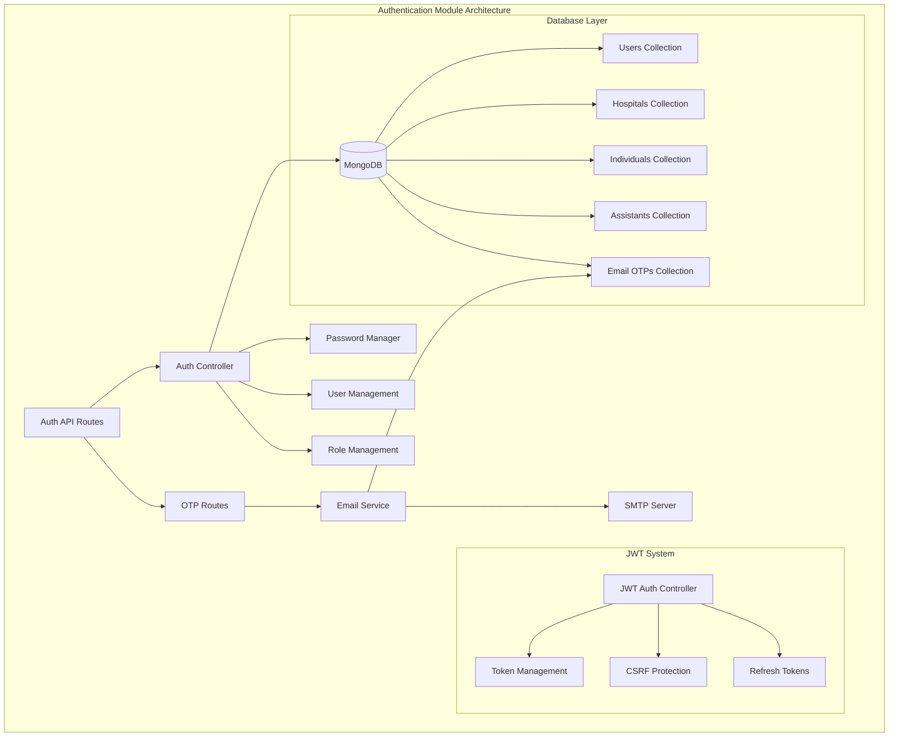

## Core Components

### 1. Authentication Controller (`controller.py`)

The main controller responsible for user registration, authentication, and user management operations.

**Key Responsibilities:**
- User registration for hospitals and individuals
- User authentication and password verification
- Assistant user management
- Password update and management
- User data retrieval for token generation

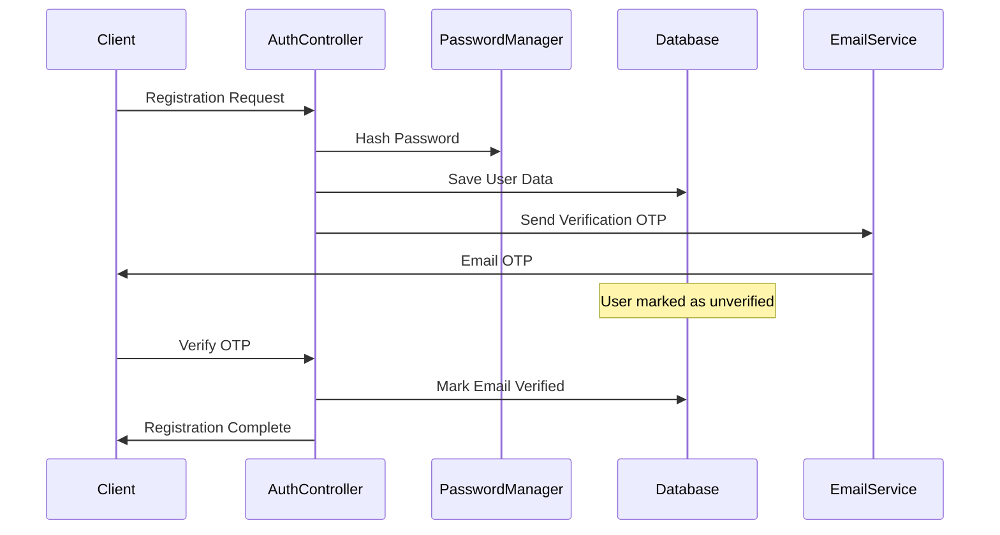

### 2. JWT Authentication System

#### JWT Auth Controller (`middlewares/jwt_auth.py`)
Comprehensive JWT token management with security features.

**Features:**
- **Access Tokens**: Short-lived tokens for API access
- **Refresh Tokens**: Long-lived tokens for token renewal
- **CSRF Protection**: Anti-CSRF token implementation
- **Token Revocation**: Blacklist management for compromised tokens
- **Cookie Security**: HttpOnly, Secure, SameSite cookies

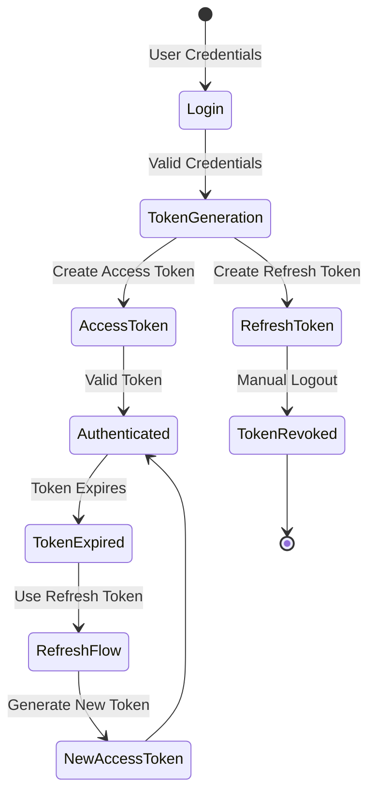

### 3. Email Service (`email_service.py`)

Secure email service for OTP delivery and password reset functionality.

**Capabilities:**
- **OTP Generation**: 6-digit secure OTP generation
- **Rate Limiting**: Anti-abuse protection (5 OTPs per hour)
- **Email Templates**: Professional email formatting
- **SMTP Integration**: Gmail SMTP with SSL/TLS
- **Purpose Tracking**: Separate OTP purposes (signup, password reset)

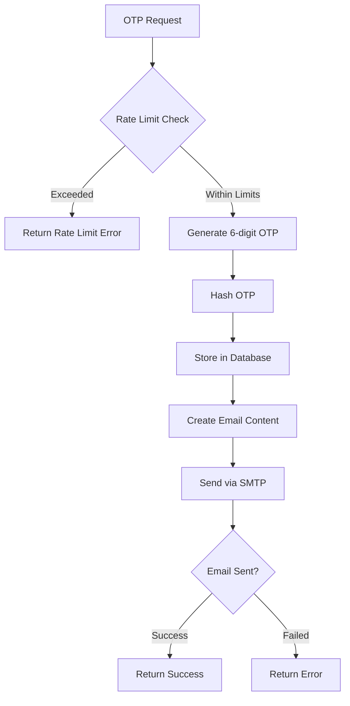

### 4. Data Models and Schema

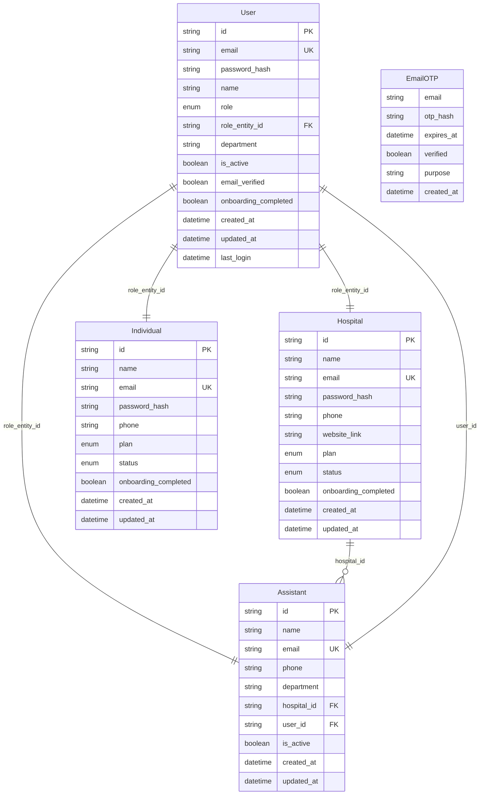

## API Endpoints

### User Registration

#### Hospital Registration
```http
POST /auth/hospital/register
```

**Request Body:**
```json
{
    "email": "admin@hospital.com",
    "password": "SecurePass123!",
    "name": "General Hospital",
    "phone": "+1234567890",
    "website_link": "https://hospital.com",
    "plan": "pro",
    "admin_name": "Dr. John Smith",
    "type": "organization"
}
```

**Response:**
```json
{
    "success": true,
    "pending_verification": true,
    "user": {
        "id": "user_123",
        "email": "admin@hospital.com",
        "role": "hospital",
        "role_entity_id": "hospital_456"
    }
}
```

#### Individual Registration
```http
POST /auth/individual/register
```

**Request Body:**
```json
{
    "email": "user@example.com",
    "password": "SecurePass123!",
    "name": "John Doe",
    "phone": "+1234567890",
    "plan": "lite",
    "type": "individual"
}
```

### Authentication

#### Login
```http
POST /auth/login
```

**Request Body:**
```json
{
    "email": "user@example.com",
    "password": "SecurePass123!"
}
```

**Response:**
```json
{
    "success": true,
    "user": {
        "id": "user_123",
        "email": "user@example.com",
        "role": "individual",
        "role_entity_id": "individual_456"
    },
    "csrf_token": "csrf_abc123"
}
```

**Cookies Set:**
- `access_token`: HttpOnly, Secure, 15-minute expiry
- `refresh_token`: HttpOnly, Secure, 7-day expiry

#### Logout
```http
POST /auth/logout
```

**Headers:**
```
X-CSRF-Token: csrf_abc123
Cookie: access_token=...; refresh_token=...
```

#### Token Refresh
```http
POST /auth/refresh
```

**Cookies Required:**
- `refresh_token`: Valid refresh token

### User Management

#### Get Current User
```http
GET /auth/me
```

**Response:**
```json
{
    "user_id": "user_123",
    "role_entity_id": "individual_456",
    "role": "individual",
    "email": "user@example.com",
    "name": "John Doe",
    "phone": "+1234567890",
    "plan": "lite",
    "authenticated": true
}
```

#### Update Password
```http
POST /auth/password/update
```

**Headers:**
```
X-CSRF-Token: csrf_abc123
```

**Request Body:**
```json
{
    "current_password": "OldPass123!",
    "new_password": "NewPass123!"
}
```

### Assistant Management (Hospital Only)

#### Create Assistant
```http
POST /auth/assistants
```

**Headers:**
```
X-CSRF-Token: csrf_abc123
Authorization: Bearer <hospital_admin_token>
```

**Request Body:**
```json
{
    "email": "assistant@hospital.com",
    "password": "AssistantPass123!",
    "name": "Jane Smith",
    "department": "Nursing",
    "phone": "+1234567890"
}
```

#### Get All Assistants
```http
GET /auth/assistants
```

#### Get Specific Assistant
```http
GET /auth/assistants/{assistant_id}
```

#### Update Assistant
```http
PUT /auth/assistants/{assistant_id}
```

#### Delete Assistant
```http
DELETE /auth/assistants/{assistant_id}
```

### OTP and Email Verification

#### Send OTP
```http
POST /auth/otp/send
```

**Request Body:**
```json
{
    "email": "user@example.com"
}
```

#### Verify OTP
```http
POST /auth/otp/verify
```

**Request Body:**
```json
{
    "email": "user@example.com",
    "otp": "123456"
}
```

### Password Reset

#### Request Password Reset
```http
POST /auth/password/reset/request
```

**Request Body:**
```json
{
    "email": "user@example.com"
}
```

#### Confirm Password Reset
```http
POST /auth/password/reset/confirm
```

**Request Body:**
```json
{
    "email": "user@example.com",
    "otp": "123456",
    "new_password": "NewSecurePass123!"
}
```

## Authentication Workflows

### Registration and Verification Flow

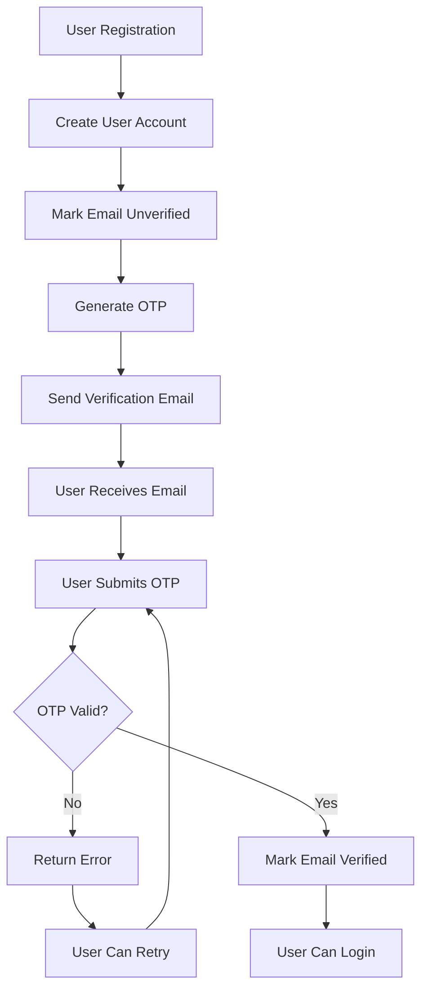

### Login and JWT Flow

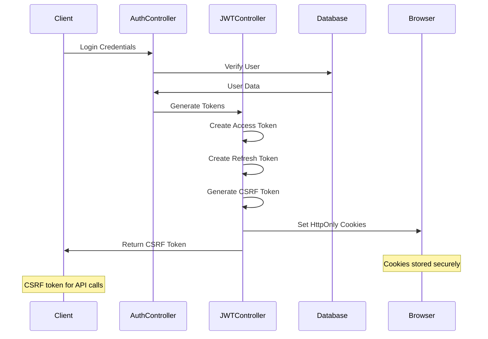

### Password Reset Flow

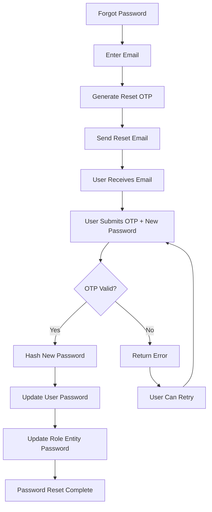

## Security Features

### Password Security

**Requirements:**
- Minimum 8 characters
- At least one uppercase letter
- At least one lowercase letter
- At least one digit
- Bcrypt hashing with salt

```python
# Password validation example
def password_validator(v: str) -> str:
    if len(v) < 8:
        raise ValueError('Password must be at least 8 characters long')
    if not any(c.isupper() for c in v):
        raise ValueError('Password must contain at least one uppercase letter')
    if not any(c.islower() for c in v):
        raise ValueError('Password must contain at least one lowercase letter')
    if not any(c.isdigit() for c in v):
        raise ValueError('Password must contain at least one digit')
    return v
```

### JWT Security

**Token Configuration:**
```python
# Access Token (15 minutes)
access_token_expire = timedelta(minutes=15)

# Refresh Token (7 days)
refresh_token_expire = timedelta(days=7)

# Cookie Security
cookie_settings = {
    "httponly": True,
    "secure": True,
    "samesite": "strict",
    "path": "/"
}
```

### CSRF Protection

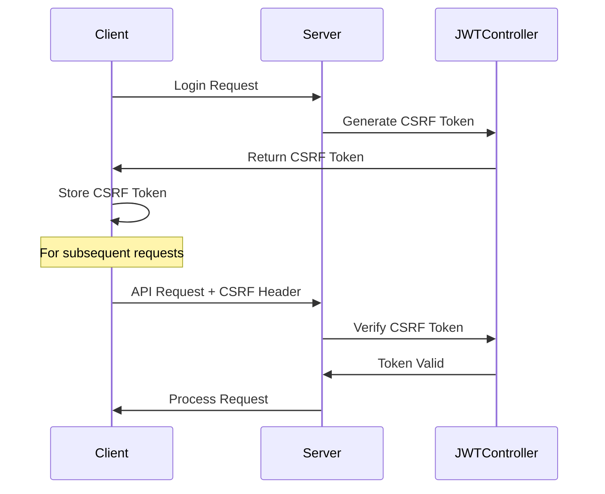

### Rate Limiting

**OTP Rate Limiting:**
- Maximum 5 OTP requests per email per hour
- Automatic cleanup of expired OTPs
- Abuse detection and prevention

```python
# Rate limiting implementation
def check_rate_limit(email: str) -> bool:
    cutoff = datetime.utcnow() - timedelta(hours=1)
    recent_count = collection.count_documents({
        "email": email,
        "created_at": {"$gte": cutoff},
    })
    return recent_count < 5
```

## Role-Based Access Control (RBAC)

### User Roles

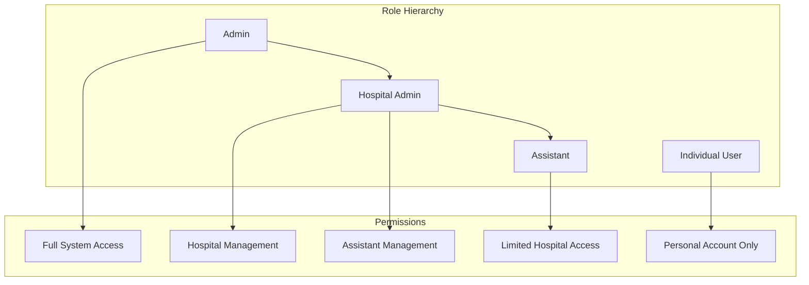

### Permission Matrix

| Role | Create Users | Manage Assistants | Access Hospital Data | Manage Own Profile | Admin Functions |
|------|-------------|-------------------|---------------------|-------------------|-----------------|
| Admin | ✅ | ✅ | ✅ | ✅ | ✅ |
| Hospital | ✅ (Assistants) | ✅ | ✅ | ✅ | ❌ |
| Assistant | ❌ | ❌ | ✅ (Limited) | ✅ | ❌ |
| Individual | ❌ | ❌ | ❌ | ✅ | ❌ |

### Authorization Middleware

```python
# Example authorization check
@router.post("/assistants")
async def create_assistant(
    request: AssistantCreationRequest,
    current_user: JWTClaims = Depends(jwt_auth.get_current_user),
    csrf_token: str = Header(..., alias="X-CSRF-Token")
):
    if current_user.role not in [UserRole.HOSPITAL, UserRole.ADMIN]:
        raise HTTPException(
            status_code=status.HTTP_403_FORBIDDEN,
            detail="Only hospital administrators can create assistants"
        )
    # Process request...
```

## Database Schema

### Collections Structure

#### Users Collection
```javascript
{
    "_id": ObjectId,
    "id": "user_123",
    "email": "user@example.com",
    "password_hash": "$2b$12$...",
    "name": "John Doe",
    "role": "individual",
    "role_entity_id": "individual_456",
    "department": null,
    "is_active": true,
    "email_verified": true,
    "onboarding_completed": false,
    "created_at": ISODate,
    "updated_at": ISODate,
    "last_login": ISODate
}
```

#### Hospitals Collection
```javascript
{
    "_id": ObjectId,
    "id": "hospital_123",
    "name": "General Hospital",
    "email": "admin@hospital.com",
    "password_hash": "$2b$12$...",
    "phone": "+1234567890",
    "website_link": "https://hospital.com",
    "plan": "pro",
    "status": "active",
    "onboarding_completed": false,
    "created_at": ISODate,
    "updated_at": ISODate
}
```

#### Email OTPs Collection
```javascript
{
    "_id": ObjectId,
    "email": "user@example.com",
    "otp_hash": "$2b$12$...",
    "expires_at": ISODate,
    "verified": false,
    "purpose": "signup",
    "created_at": ISODate
}
```

### Database Indexes

```javascript
// Users collection indexes
db.users.createIndex({ "email": 1 }, { unique: true })
db.users.createIndex({ "id": 1 }, { unique: true })
db.users.createIndex({ "role_entity_id": 1 })

// Hospitals collection indexes
db.hospitals.createIndex({ "email": 1 }, { unique: true })
db.hospitals.createIndex({ "id": 1 }, { unique: true })

// Email OTPs collection indexes
db.email_otps.createIndex({ "email": 1, "purpose": 1 })
db.email_otps.createIndex({ "expires_at": 1 }, { expireAfterSeconds: 0 })
```

## Configuration and Environment

### Environment Variables

```bash
# JWT Configuration
JWT_SECRET_KEY=your-super-secret-jwt-key
JWT_ALGORITHM=HS256
ACCESS_TOKEN_EXPIRE_MINUTES=15
REFRESH_TOKEN_EXPIRE_DAYS=7

# Database Configuration
MONGODB_URI=mongodb://localhost:27017
DATABASE_NAME=polaris_db

# Email Configuration
SMTP_GMAIL_USER=your-email@gmail.com
SMTP_GMAIL_PASS=your-app-password
OTP_TTL=10

# Security Configuration
CSRF_SECRET_KEY=your-csrf-secret-key
COOKIE_DOMAIN=yourdomain.com
COOKIE_SECURE=true
```

### Application Configuration

```python
# config.py example
class Settings(BaseSettings):
    # JWT Settings
    JWT_SECRET_KEY: str
    JWT_ALGORITHM: str = "HS256"
    ACCESS_TOKEN_EXPIRE_MINUTES: int = 15
    REFRESH_TOKEN_EXPIRE_DAYS: int = 7
    
    # Database Settings
    MONGODB_URI: str
    DATABASE_NAME: str
    
    # Email Settings
    SMTP_GMAIL_USER: str
    SMTP_GMAIL_PASS: str
    OTP_TTL: int = 10
    
    class Config:
        env_file = ".env"
```

## Error Handling

### Common Error Responses

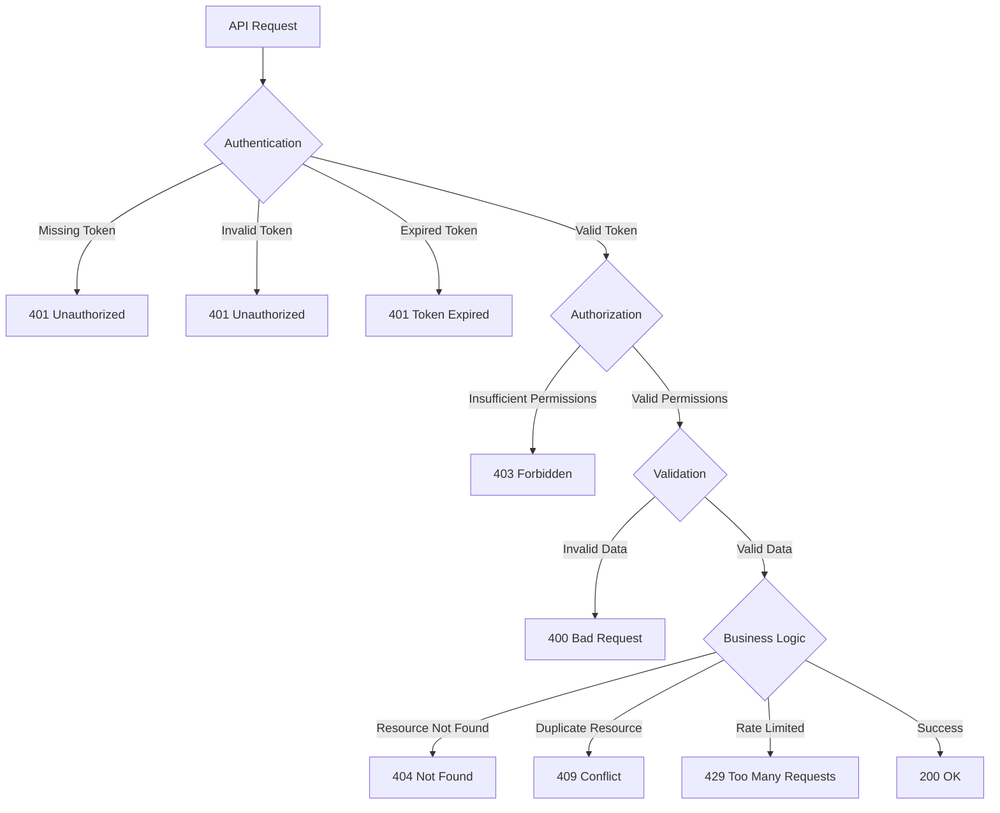

### Error Response Format

```json
{
    "detail": "Detailed error message",
    "error_code": "AUTH_001",
    "field_errors": {
        "email": ["Invalid email format"],
        "password": ["Password too weak"]
    },
    "timestamp": "2024-01-15T10:00:00Z"
}
```

### Common Error Codes

| Code | Message | Description |
|------|---------|-------------|
| AUTH_001 | Invalid credentials | Email or password incorrect |
| AUTH_002 | Email not verified | Account requires email verification |
| AUTH_003 | Account deactivated | User account is disabled |
| AUTH_004 | Token expired | JWT token has expired |
| AUTH_005 | Invalid OTP | OTP is incorrect or expired |
| AUTH_006 | Rate limit exceeded | Too many requests in time window |
| AUTH_007 | Insufficient permissions | User lacks required permissions |

## Testing Guide

### Unit Testing

```python
# Example authentication test
async def test_user_registration():
    registration_data = {
        "email": "test@example.com",
        "password": "TestPass123!",
        "name": "Test User",
        "type": "individual"
    }
    
    response = await client.post("/auth/individual/register", json=registration_data)
    assert response.status_code == 200
    assert response.json()["success"] is True
    assert response.json()["pending_verification"] is True

async def test_login_flow():
    # Register user first
    await test_user_registration()
    
    # Verify email (mock OTP verification)
    await verify_email_otp("test@example.com", "123456")
    
    # Login
    login_data = {
        "email": "test@example.com",
        "password": "TestPass123!"
    }
    
    response = await client.post("/auth/login", json=login_data)
    assert response.status_code == 200
    assert "csrf_token" in response.json()
    assert "access_token" in response.cookies
```

### Integration Testing

```python
# Example end-to-end test
async def test_complete_auth_flow():
    # 1. Register
    registration_response = await register_user()
    user_id = registration_response["user"]["id"]
    
    # 2. Verify email
    await verify_user_email(user_id)
    
    # 3. Login
    login_response = await login_user()
    csrf_token = login_response["csrf_token"]
    
    # 4. Access protected endpoint
    headers = {"X-CSRF-Token": csrf_token}
    profile_response = await client.get("/auth/me", headers=headers)
    assert profile_response.status_code == 200
    
    # 5. Logout
    logout_response = await client.post("/auth/logout", headers=headers)
    assert logout_response.status_code == 200
```

### Security Testing

```python
# Test password requirements
async def test_password_security():
    weak_passwords = [
        "12345678",  # No letters
        "password",  # No uppercase, no numbers
        "PASSWORD",  # No lowercase, no numbers
        "Pass123",   # Too short
    ]
    
    for password in weak_passwords:
        registration_data = {
            "email": f"test{password}@example.com",
            "password": password,
            "name": "Test User",
            "type": "individual"
        }
        
        response = await client.post("/auth/individual/register", json=registration_data)
        assert response.status_code == 422  # Validation error

# Test rate limiting
async def test_otp_rate_limiting():
    email = "ratelimit@example.com"
    
    # Send 5 OTPs (should work)
    for i in range(5):
        response = await client.post("/auth/otp/send", json={"email": email})
        assert response.status_code == 202
    
    # 6th OTP should be rate limited
    response = await client.post("/auth/otp/send", json={"email": email})
    assert response.status_code == 429
```

## Performance Optimization

### Database Optimization

1. **Indexing Strategy**
```javascript
// Compound indexes for common queries
db.users.createIndex({ "email": 1, "is_active": 1 })
db.assistants.createIndex({ "hospital_id": 1, "is_active": 1 })
```

2. **Connection Pooling**
```python
# MongoDB connection pool
client = MongoClient(
    MONGODB_URI,
    maxPoolSize=50,
    minPoolSize=10,
    maxIdleTimeMS=30000
)
```

### Caching Strategy

```python
# Redis caching for frequently accessed data
import redis
from functools import wraps

redis_client = redis.Redis(host='localhost', port=6379, db=0)

def cache_user_data(func):
    @wraps(func)
    async def wrapper(user_id: str):
        cache_key = f"user:{user_id}"
        cached_data = redis_client.get(cache_key)
        
        if cached_data:
            return json.loads(cached_data)
        
        result = await func(user_id)
        redis_client.setex(cache_key, 300, json.dumps(result))  # 5 min cache
        return result
    
    return wrapper
```

### JWT Optimization

```python
# JWT token optimization
JWT_SETTINGS = {
    "algorithm": "HS256",  # Faster than RSA
    "access_token_expire": 15,  # Short-lived tokens
    "refresh_token_expire": 7 * 24 * 60,  # 7 days in minutes
    "issuer": "polaris-auth",
    "audience": "polaris-api"
}
```

## Security Best Practices

### Password Security

1. **Bcrypt Configuration**
```python
# Optimal bcrypt rounds (12-14)
pwd_context = CryptContext(
    schemes=["bcrypt"],
    deprecated="auto",
    bcrypt__rounds=12
)
```

2. **Password Policies**
- Minimum complexity requirements
- Password history (prevent reuse)
- Regular password rotation reminders

### Token Security

1. **JWT Best Practices**
- Short access token lifetime (15 minutes)
- Secure refresh token storage
- Token rotation on refresh
- Proper token revocation

2. **Cookie Security**
```python
cookie_settings = {
    "httponly": True,      # Prevent XSS
    "secure": True,        # HTTPS only
    "samesite": "strict",  # CSRF protection
    "path": "/",
    "domain": "yourdomain.com"
}
```

### API Security

1. **Rate Limiting**
- Global rate limits per IP
- Per-user rate limits
- Endpoint-specific limits

2. **Input Validation**
- Pydantic schema validation
- SQL injection prevention
- XSS protection

3. **HTTPS Enforcement**
```python
# Force HTTPS in production
if not request.url.scheme == "https" and settings.ENVIRONMENT == "production":
    return RedirectResponse(
        url=request.url.replace(scheme="https"),
        status_code=301
    )
```

## Troubleshooting

### Common Issues

#### 1. JWT Token Issues
**Symptoms:** 401 Unauthorized errors
**Causes:**
- Expired access tokens
- Invalid JWT secret
- Clock skew between servers

**Solutions:**
```python
# Debug JWT token
import jwt

def debug_token(token: str):
    try:
        decoded = jwt.decode(token, verify=False)
        print(f"Token payload: {decoded}")
        print(f"Token expires: {datetime.fromtimestamp(decoded['exp'])}")
    except Exception as e:
        print(f"Token decode error: {e}")
```

#### 2. Email Delivery Issues
**Symptoms:** OTP emails not received
**Causes:**
- SMTP configuration errors
- Gmail app password issues
- Rate limiting

**Solutions:**
```python
# Test email configuration
def test_email_config():
    try:
        with smtplib.SMTP_SSL("smtp.gmail.com", 465) as smtp:
            smtp.login(SMTP_USER, SMTP_PASS)
            print("SMTP connection successful")
    except Exception as e:
        print(f"SMTP error: {e}")
```

#### 3. Database Connection Issues
**Symptoms:** Authentication failures with database errors
**Solutions:**
```python
# Test database connection
def test_database_connection():
    try:
        client = MongoClient(MONGODB_URI, serverSelectionTimeoutMS=5000)
        client.server_info()
        print("Database connection successful")
    except Exception as e:
        print(f"Database connection error: {e}")
```

### Debug Commands

```bash
# Check authentication status
curl -X GET "http://localhost:8000/auth/me" \
  -H "Cookie: access_token=your_token"

# Test registration
curl -X POST "http://localhost:8000/auth/individual/register" \
  -H "Content-Type: application/json" \
  -d '{"email":"test@example.com","password":"Test123!","name":"Test User","type":"individual"}'

# Test login
curl -X POST "http://localhost:8000/auth/login" \
  -H "Content-Type: application/json" \
  -d '{"email":"test@example.com","password":"Test123!"}'

# Test OTP verification
curl -X POST "http://localhost:8000/auth/otp/verify" \
  -H "Content-Type: application/json" \
  -d '{"email":"test@example.com","otp":"123456"}'
```

## Future Enhancements

### Planned Features

1. **Multi-Factor Authentication (MFA)**
   - TOTP (Google Authenticator)
   - SMS-based verification
   - Hardware security keys

2. **OAuth Integration**
   - Google OAuth
   - Microsoft Azure AD
   - Apple Sign-In

3. **Advanced Security**
   - Device fingerprinting
   - Anomaly detection
   - Geographic access controls

4. **Enterprise Features**
   - SAML SSO integration
   - Active Directory integration
   - Audit logging and compliance

### Technical Improvements

1. **Performance**
   - Redis session storage
   - JWT stateless optimization
   - Database query optimization

2. **Monitoring**
   - Authentication metrics
   - Security event logging
   - Real-time alerting

3. **Scalability**
   - Microservice architecture
   - Distributed JWT validation
   - Load balancer integration