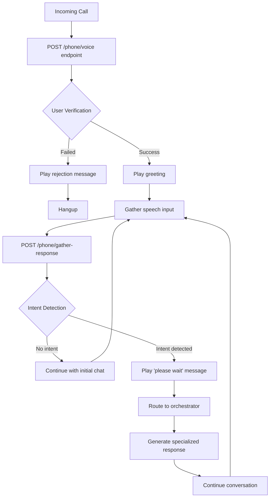
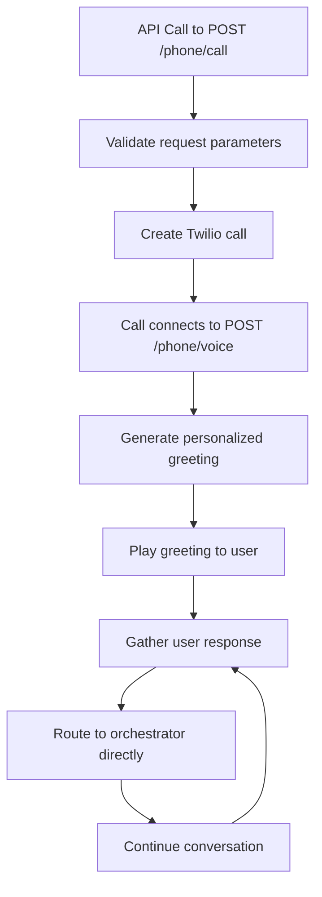
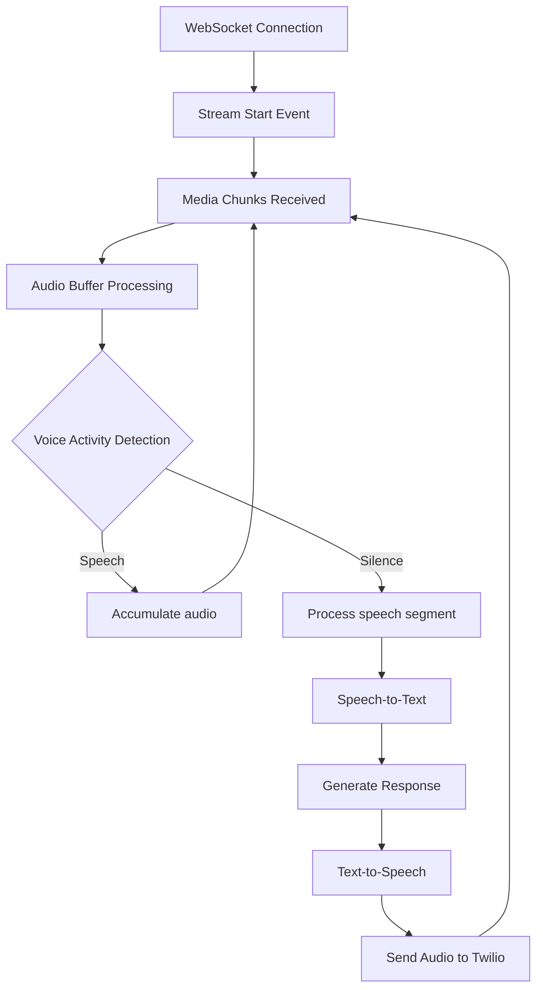
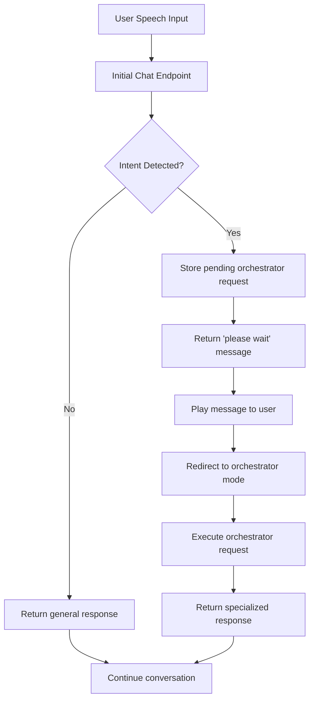
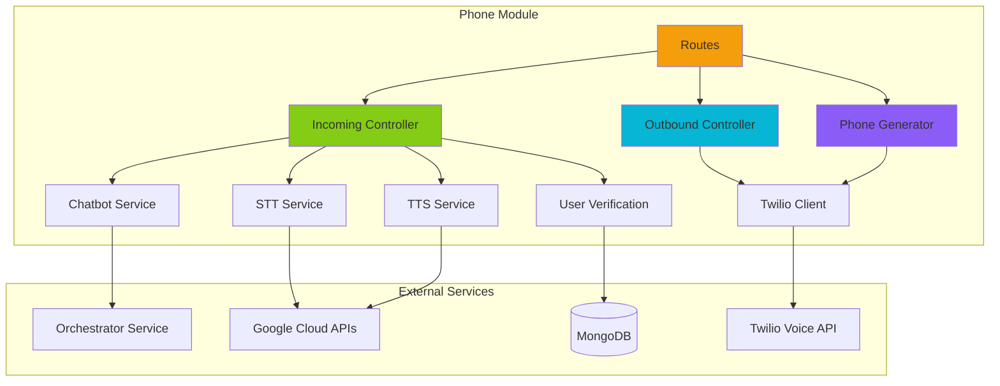
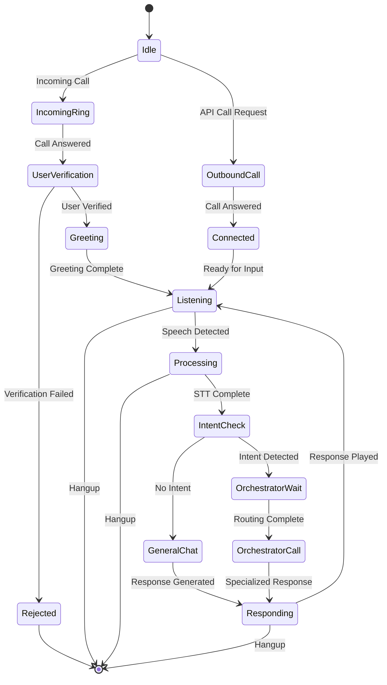
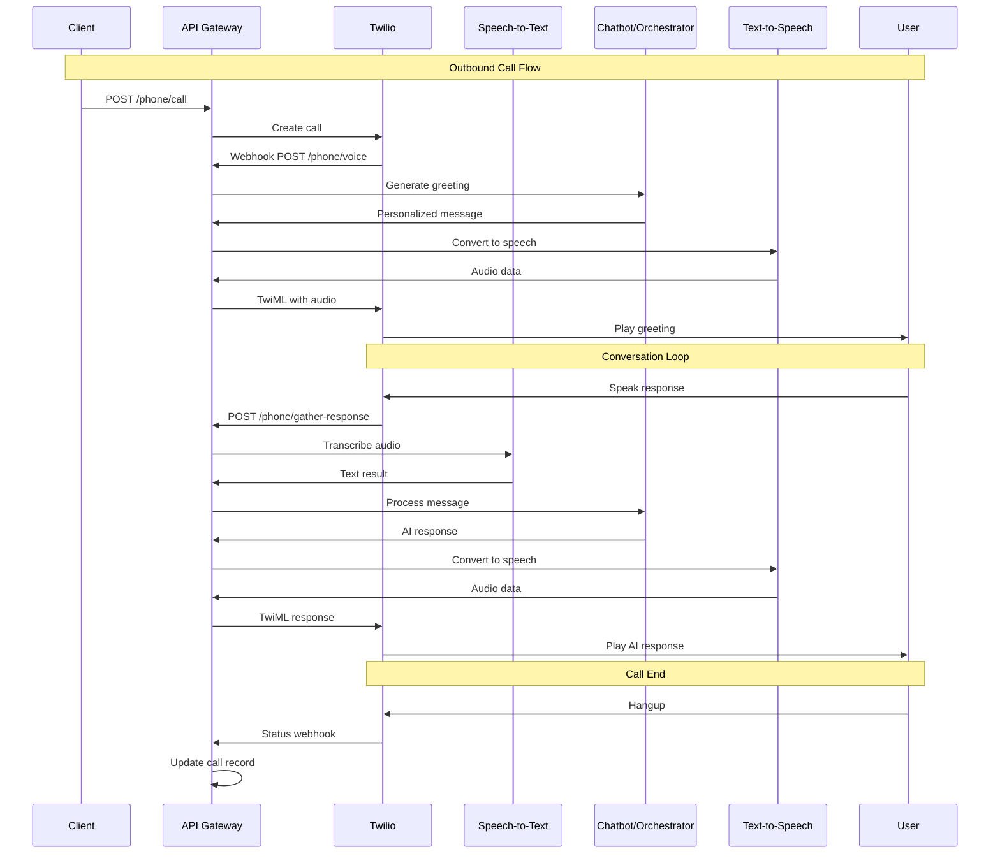

# Phone Module Documentation

## Table of Contents
1. [Overview](#overview)
2. [Architecture](#architecture)
3. [Configuration](#configuration)
4. [API Endpoints](#api-endpoints)
5. [Services](#services)
6. [Controllers](#controllers)
7. [Data Models](#data-models)
8. [Call Flow Diagrams](#call-flow-diagrams)
9. [Testing Guide](#testing-guide)
10. [Troubleshooting](#troubleshooting)

## Overview

The Phone Module is a comprehensive telephony system built on top of Twilio's Voice API that provides AI-powered conversational capabilities. It supports both incoming and outgoing voice calls with real-time speech-to-text, text-to-speech, and intelligent chatbot interactions.

### Key Features
- **Incoming Call Handling**: Automated voice responses with user verification
- **Outbound Call Management**: Programmatic call initiation with personalized messaging
- **Real-time Voice Processing**: WebSocket-based audio streaming with low-latency processing
- **Intent Detection**: Two-stage conversation flow for intelligent call routing
- **User Verification**: Phone number-based user authentication
- **Hospital Number Generation**: Automated Twilio subaccount and phone number provisioning

## Architecture

```
┌─────────────────────────────────────────────────────────────────┐
│                        Phone Module                             │
├─────────────────────────────────────────────────────────────────┤
│  ┌─────────────┐  ┌─────────────┐  ┌─────────────┐              │
│  │   Routes    │  │ Controllers │  │  Services   │              │
│  │             │  │             │  │             │              │
│  │ • voice     │  │ • incoming  │  │ • chatbot   │              │
│  │ • call      │  │ • outbound  │  │ • stt       │              │
│  │ • gather    │  │ • generate  │  │ • tts       │              │
│  │ • status    │  │             │  │ • verify    │              │
│  │ • websocket │  │             │  │             │              │
│  └─────────────┘  └─────────────┘  └─────────────┘              │
├─────────────────────────────────────────────────────────────────┤
│                    External Services                            │
│  ┌─────────────┐  ┌─────────────┐  ┌─────────────┐              │
│  │   Twilio    │  │   Google    │  │ Orchestrator│              │
│  │   Voice     │  │ Cloud APIs  │  │   Service   │              │
│  └─────────────┘  └─────────────┘  └─────────────┘              │
└─────────────────────────────────────────────────────────────────┘
```

## Configuration

### Environment Variables Required

```bash
# Twilio Configuration
TWILIO_ACCOUNT_SID=your_account_sid
TWILIO_AUTH_TOKEN=your_auth_token
TWILIO_PHONE_NUMBER=+1234567890
TWILIO_BASE_WEBHOOK_URL=https://your-domain.com

# Service URLs
ORCHESTRATOR_URL=http://orchestrator-service:8000
HOST_URL=https://your-api-domain.com

# Google Cloud Configuration
GOOGLE_CREDENTIALS_PATH=/path/to/credentials.json
GOOGLE_PROJECT_ID=your-project-id

# Gemini Configuration
GEMINI_API_KEY=your_gemini_api_key
GEMINI_MODEL=gemini-1.5-flash

# Audio Settings
AUDIO_SAMPLE_RATE=8000
AUDIO_CHANNELS=1
AUDIO_ENCODING=mulaw
```

### Settings Class (`config.py`)

The `Settings` class manages all configuration with Pydantic validation:

```python
class Settings(BaseSettings):
    # Server settings
    PORT: int = 8000
    DEBUG: bool = False
    
    # Twilio settings
    TWILIO_ACCOUNT_SID: str
    TWILIO_AUTH_TOKEN: str
    TWILIO_PHONE_NUMBER: str
    TWILIO_BASE_WEBHOOK_URL: str
    
    # Service URLs
    ORCHESTRATOR_URL: str
    
    # Audio configuration
    AUDIO_SAMPLE_RATE: int = 8000
    AUDIO_CHANNELS: int = 1
    AUDIO_ENCODING: str = "mulaw"
```

## API Endpoints

### Core Voice Endpoints

#### 1. Handle Incoming Voice Calls
```http
POST /phone/voice
```

**Purpose**: Primary webhook for Twilio voice calls (both incoming and outgoing)

**Request Body** (Twilio webhook format):
```json
{
  "CallSid": "CA1234567890abcdef",
  "AccountSid": "AC1234567890abcdef", 
  "From": "+1234567890",
  "To": "+0987654321",
  "CallStatus": "ringing",
  "Direction": "inbound"
}
```

**Query Parameters**:
- `user_profile_id` (optional): User profile identifier
- `created_by` (optional): User ID who initiated the call
- `agent_instance_id` (optional): Specific agent instance
- `conversation_id` (optional): Conversation tracking ID

**Response**: TwiML (XML)
```xml
<?xml version="1.0" encoding="UTF-8"?>
<Response>
    <Say voice="Polly.Joanna-Neural" language="en-US">
        Hello! I'm your AI assistant. How can I help you today?
    </Say>
    <Gather input="speech" action="/phone/gather-response" method="POST" timeout="5">
    </Gather>
</Response>
```

#### 2. Make Outbound Call
```http
POST /phone/call
```

**Purpose**: Initiate outbound calls programmatically

**Request Body**:
```json
{
  "to_number": "1234567890",
  "from_number": "+0987654321",
  "user_profile_id": "user_123",
  "created_by": "admin_456",
  "agent_instance_id": "agent_789",
  "message": "Initial message to speak",
  "timeout": 60,
  "record": false
}
```

**Response**:
```json
{
  "call_sid": "CA1234567890abcdef",
  "status": "initiated",
  "message": "Call to 1234567890 initiated",
  "details": {
    "from": "+0987654321",
    "to": "1234567890",
    "status": "queued"
  }
}
```

#### 3. Handle Speech Gathering
```http
POST /phone/gather-response
```

**Purpose**: Process user speech input from Twilio's Gather verb

**Request Body**:
```json
{
  "CallSid": "CA1234567890abcdef",
  "SpeechResult": "I need help with my medication",
  "Confidence": "0.95"
}
```

**Query Parameters**:
- `call_sid`: Call identifier
- `user_profile_id`: User profile ID
- `orchestrator_mode`: "true" for orchestrator mode routing

**Response**: TwiML with AI-generated response

#### 4. WebSocket Media Stream
```http
WebSocket /phone/ws/{call_sid}
```

**Purpose**: Real-time audio streaming for advanced voice processing

**Connection Flow**:
1. Client connects with call_sid
2. Receives `connected`, `start`, `media`, `stop` events
3. Processes audio chunks in real-time
4. Streams responses back to caller

### Call Management Endpoints

#### 5. Get Call Status
```http
GET /phone/call/{call_sid}
```

**Purpose**: Retrieve current status of a specific call

**Response**:
```json
{
  "call_sid": "CA1234567890abcdef",
  "status": "in-progress",
  "direction": "outbound-api",
  "from": "+0987654321",
  "to": "+1234567890",
  "duration": 45,
  "start_time": "2025-09-15T10:30:00Z",
  "price": "0.013",
  "price_unit": "USD"
}
```

#### 6. Cancel Call
```http
POST /phone/call/{call_sid}/cancel
```

**Purpose**: Cancel an active or queued call

**Response**:
```json
{
  "status": "success",
  "message": "Call CA1234567890abcdef canceled"
}
```

#### 7. Call Status Webhook
```http
POST /phone/status
```

**Purpose**: Receive call status updates from Twilio

**Request Body**:
```json
{
  "CallSid": "CA1234567890abcdef",
  "CallStatus": "completed",
  "CallDuration": "120",
  "RecordingUrl": "https://api.twilio.com/recordings/RE123.mp3"
}
```

### Chatbot Endpoints

#### 8. Chatbot Interaction
```http
POST /phone/chatbot
```

**Purpose**: Direct chatbot interaction endpoint

**Request Body**:
```json
{
  "userText": "I need help with my prescription",
  "context": {
    "user_id": "user_123",
    "conversation_history": []
  }
}
```

**Response**: Streaming text response
```
data: {"response": "I'd be happy to help you with your prescription."}

data: {"response": "What specific questions do you have?"}

data: {"response": "[DONE]"}
```

### Utility Endpoints

#### 9. Test User Verification
```http
POST /phone/test-verification
```

**Purpose**: Test user verification by phone number

**Request Body**:
```json
{
  "phone_number": "+1234567890"
}
```

**Response**:
```json
{
  "verified": true,
  "user_exists": true,
  "user_profile": {
    "id": "user_123",
    "phone": "+1234567890",
    "plan": "premium"
  },
  "message": "User verified successfully"
}
```

## Services

### 1. Chatbot Service (`chatbot_service.py`)

**Purpose**: AI conversation management using Google Gemini

**Key Features**:
- Ultra-low latency streaming responses
- Pre-built quick responses for common phrases
- Concurrency control with semaphores
- Context-aware conversation handling

**Methods**:
```python
async def handle_streaming_chatbot_request(request: ChatbotRequest)
async def get_streaming_response(user_text: str, context: Optional[List[Dict]] = None)
```

**Configuration**:
- Temperature: 0.7
- Max tokens: 150 (optimized for voice)
- Safety settings: Block medium and above harmful content
- Quick response patterns for greetings, thanks, goodbye

### 2. Speech-to-Text Service (`stt_service.py`)

**Purpose**: Google Cloud Speech-to-Text integration

**Key Features**:
- Phone call optimized configuration
- Dual configuration (partial vs final results)
- Thread pool for non-blocking processing
- Healthcare-specific vocabulary enhancement

**Methods**:
```python
async def transcribe_audio(audio_data: bytes, is_final: bool = False)
async def stream_transcribe_audio(audio_stream: AsyncGenerator[bytes, None])
```

**Configuration**:
- Encoding: MULAW (8kHz phone quality)
- Model: "phone_call" (optimized for telephony)
- Enhanced: True for final results
- Speech contexts: Medical terminology

### 3. Text-to-Speech Service (`tts_service.py`)

**Purpose**: Google Cloud Text-to-Speech integration

**Key Features**:
- Phone-optimized audio encoding
- Neural voice selection
- Telephony-class audio effects
- Asynchronous processing

**Methods**:
```python
async def text_to_speech(text: str, voice: str = "en-US-Neural2-F")
```

**Configuration**:
- Voice: en-US-Neural2-F (high-quality female neural voice)
- Encoding: MULAW 8kHz (phone compatible)
- Effects: telephony-class-application

### 4. User Verification Service (`userVerification.py`)

**Purpose**: Phone number-based user authentication

**Key Features**:
- MongoDB user_profiles collection integration
- Phone number normalization
- Multi-format phone number support
- Premium plan validation

**Methods**:
```python
async def verify_user_by_phone(phone_number: str)
def get_premium_plan_message()
def get_user_not_found_message()
```

**Phone Number Cleaning**:
- Removes formatting characters: +, -, (), spaces
- Handles country codes (US: +1, India: +91)
- Normalizes to 10-digit format

## Controllers

### 1. Incoming Controller (`incoming.py`)

**Purpose**: Comprehensive incoming call management

**Key Components**:

#### Enhanced Audio Buffer
- Continuous audio streaming with VAD (Voice Activity Detection)
- Smart chunking and segmentation
- Background noise adaptation
- Speech/silence state machine

#### Speech Recognition Manager
- Partial and final transcription handling
- Text stability calculation
- Intelligent text merging
- Confidence-based filtering

#### Main Controller Features
- Two-stage conversation flow (initial chat → orchestrator)
- User verification integration
- WebSocket media streaming
- Call context management
- Interrupt detection

**Key Methods**:
```python
async def handle_voice_call(request: Request)
async def handle_gather_response(request: Request) 
async def handle_media_stream(websocket: WebSocket, call_sid: str)
```

### 2. Outbound Controller (`outbound.py`)

**Purpose**: Outbound call initiation and management

**Key Features**:
- Twilio call creation with proper callback URLs
- Call record tracking
- Status monitoring
- Batch call support (planned)
- Error handling and retry logic

**Key Methods**:
```python
async def make_call(request: OutboundCallRequest)
async def get_call_status(call_sid: str)
async def cancel_call(call_sid: str)
```

### 3. Phone Generator Controller (`phoneGenerate.py`)

**Purpose**: Automated Twilio number provisioning for hospitals

**Key Features**:
- Twilio subaccount creation
- Phone number purchasing
- Webhook URL configuration
- Database integration for hospital records

**Key Methods**:
```python
async def generate_hospital_number(hospital_id: str, area_code: Optional[str])
async def get_hospital_twilio_config(hospital_id: str)
```

## Data Models

### Core Models (`schema.py`)

#### CallRecord
```python
class CallRecord(BaseModel):
    call_sid: str
    account_sid: str
    from_number: str
    to_number: str
    status: CallStatus
    direction: str
    user_profile_id: Optional[str]
    created_by: Optional[str]
    agent_instance_id: Optional[str]
    start_time: datetime
    end_time: Optional[datetime] = None
    duration: Optional[int] = None
```

#### OutboundCallRequest
```python
class OutboundCallRequest(BaseModel):
    to_number: str
    from_number: Optional[str] = None
    user_profile_id: Optional[str] = None
    created_by: Optional[str] = None
    agent_instance_id: Optional[str] = None
    message: Optional[str] = None
    timeout: Optional[int] = 60
    record: bool = False
```

#### ChatbotRequest/Response
```python
class ChatbotRequest(BaseModel):
    userText: str = Field(..., min_length=1, max_length=1000)
    context: Optional[Dict[str, Any]] = None

class ChatbotResponse(BaseModel):
    response: str
    timestamp: datetime = Field(default_factory=datetime.utcnow)
```

## Call Flow Diagrams

### 1. Incoming Call Flow



### 2. Outbound Call Flow



### 3. WebSocket Media Stream Flow



### 4. Two-Stage Conversation Flow (Incoming Calls)



### 5. Service Architecture Overview



### 6. Call State Machine



### 7. API Interaction Sequence



## Testing Guide

### 1. Local Development Setup

#### Prerequisites
```bash
# Install ngrok for local webhook testing
npm install -g ngrok

# Start your FastAPI application
uvicorn main:app --host 0.0.0.0 --port 8000

# Expose local server to internet
ngrok http 8000
```

#### Environment Configuration
```bash
# Update .env file with ngrok URL
TWILIO_BASE_WEBHOOK_URL=https://abc123.ngrok.io
HOST_URL=https://abc123.ngrok.io
```

### 2. Testing Incoming Calls

#### Step 1: Configure Twilio Phone Number
1. Log into Twilio Console
2. Navigate to Phone Numbers → Manage → Active numbers
3. Click on your Twilio phone number
4. Set webhook URL: `https://your-ngrok-url.ngrok.io/phone/voice`
5. Set HTTP method: POST

#### Step 2: Test User Verification
```bash
# Test user verification endpoint
curl -X POST "http://localhost:8000/phone/test-verification" \
  -H "Content-Type: application/json" \
  -d '{"phone_number": "+1234567890"}'
```

#### Step 3: Make Test Call
1. Call your Twilio phone number
2. Verify greeting is played
3. Speak clearly and test conversation flow
4. Check logs for STT/TTS processing
5. Verify intent detection and orchestrator routing

### 3. Testing Outbound Calls

#### Basic Outbound Call Test
```bash
curl -X POST "http://localhost:8000/phone/call" \
  -H "Content-Type: application/json" \
  -d '{
    "to_number": "1234567890",
    "user_profile_id": "test_user_123",
    "created_by": "admin",
    "message": "This is a test call"
  }'
```

#### Expected Response
```json
{
  "call_sid": "CA1234567890abcdef",
  "status": "initiated",
  "message": "Call to 1234567890 initiated",
  "details": {
    "from": "+your_twilio_number",
    "to": "1234567890",
    "status": "queued"
  }
}
```

### 4. Testing Chatbot Endpoint

```bash
# Test direct chatbot interaction
curl -X POST "http://localhost:8000/phone/chatbot" \
  -H "Content-Type: application/json" \
  -d '{
    "userText": "I need help with my medication",
    "context": {"user_id": "test_user"}
  }'
```

### 5. WebSocket Testing

#### Using Python Client
```python
import asyncio
import websockets
import json
import base64

async def test_websocket():
    uri = "ws://localhost:8000/phone/ws/test_call_sid"
    
    async with websockets.connect(uri) as websocket:
        # Send test audio data
        test_message = {
            "event": "media",
            "media": {
                "payload": base64.b64encode(b"test_audio_data").decode()
            }
        }
        await websocket.send(json.dumps(test_message))
        
        # Receive response
        response = await websocket.recv()
        print(f"Received: {response}")

asyncio.run(test_websocket())
```

### 6. Testing Call Status Updates

```bash
# Get call status
curl -X GET "http://localhost:8000/phone/call/CA1234567890abcdef"

# Cancel call
curl -X POST "http://localhost:8000/phone/call/CA1234567890abcdef/cancel"
```

### 7. Load Testing

#### Using Apache Bench
```bash
# Test chatbot endpoint performance
ab -n 100 -c 10 -p chatbot_payload.json -T application/json \
  http://localhost:8000/phone/chatbot
```

#### Payload file (chatbot_payload.json)
```json
{"userText": "Hello, how are you?", "context": {}}
```

### 8. Monitoring and Logs

#### Key Log Messages to Monitor
```
INFO: Incoming call from: +1234567890
INFO: User verified: +1234567890
INFO: Intent detected: 'loneliness', switching to orchestrator
INFO: Using orchestrator endpoint: http://orchestrator:8000/orchestrate
INFO: Outbound call created: CA123 to 1234567890
```

#### Error Scenarios to Test
1. Invalid phone numbers
2. Network timeouts to external services
3. Invalid user profiles
4. Malformed audio data
5. WebSocket disconnections

## Troubleshooting

### Common Issues and Solutions

#### 1. "User verification failed"
**Symptoms**: Incoming calls are immediately rejected
**Causes**:
- Phone number not in user_profiles collection
- Phone number format mismatch
- Database connection issues

**Solutions**:
```bash
# Check user_profiles collection
db.user_profiles.find({"phone": "+1234567890"})

# Test verification endpoint
curl -X POST "localhost:8000/phone/test-verification" \
  -d '{"phone_number": "+1234567890"}'

# Check phone number formats in database
db.user_profiles.distinct("phone")
```

#### 2. "Twilio webhook timeout"
**Symptoms**: Calls connect but no TwiML response
**Causes**:
- Slow external service calls
- Database query timeouts
- Network connectivity issues

**Solutions**:
- Check service response times in logs
- Verify orchestrator service connectivity
- Implement circuit breakers for external calls
- Use asynchronous processing where possible

#### 3. "Audio quality issues"
**Symptoms**: Poor STT accuracy, garbled TTS output
**Causes**:
- Incorrect audio encoding settings
- Network packet loss
- Voice activity detection issues

**Solutions**:
```python
# Verify audio configuration
AUDIO_SAMPLE_RATE=8000
AUDIO_CHANNELS=1
AUDIO_ENCODING=mulaw

# Check VAD thresholds
VAD_SILENCE_THRESHOLD = 80
VAD_SPEECH_THRESHOLD = 250
```

#### 4. "Intent detection not working"
**Symptoms**: All calls go to general chat instead of specialists
**Causes**:
- Initial chat service unavailable
- Incorrect endpoint configuration
- Missing conversation context

**Solutions**:
- Verify HOST_URL configuration
- Check initial chat service logs
- Test intent detection endpoint directly

#### 5. "OutOfMemory errors"
**Symptoms**: Server crashes during high call volume
**Causes**:
- Audio buffer memory leaks
- Uncleared call records
- WebSocket connection accumulation

**Solutions**:
```python
# Implement proper cleanup
async def _cleanup_call(self, call_sid: str):
    # Clear processing tasks
    # Remove from active calls
    # Delete audio buffers
    # Close WebSocket connections
```

### Performance Optimization

#### 1. Audio Buffer Management
- Limit buffer duration to 10 seconds
- Implement circular buffers
- Clear completed segments regularly

#### 2. Database Optimization
- Index phone numbers in user_profiles
- Use connection pooling
- Implement query result caching

#### 3. External Service Optimization
- Use connection pooling for HTTP clients
- Implement retry with exponential backoff
- Add circuit breakers for failing services

#### 4. Memory Management
- Regular cleanup of inactive calls
- Limit concurrent WebSocket connections
- Use streaming responses for large payloads

### Monitoring and Alerting

#### Key Metrics to Monitor
1. **Call Success Rate**: Percentage of successful call completions
2. **Response Latency**: Time from speech input to TTS output
3. **STT Accuracy**: Confidence scores and error rates
4. **Service Availability**: External service uptime
5. **Memory Usage**: Audio buffer and connection memory
6. **Error Rates**: 4xx/5xx HTTP response rates

#### Recommended Alerts
- Call success rate < 95%
- Average response latency > 3 seconds
- Memory usage > 80%
- External service errors > 5%
- WebSocket disconnection rate > 10%

---

This documentation provides comprehensive coverage of the Phone Module's functionality, architecture, and operational aspects. For additional support or feature requests, please refer to the development team or create an issue in the project repository.