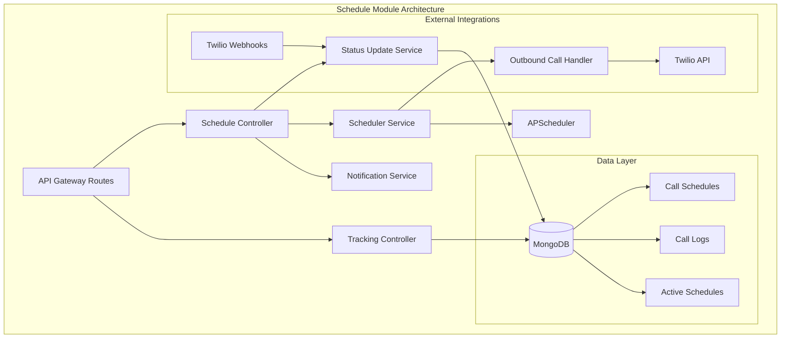
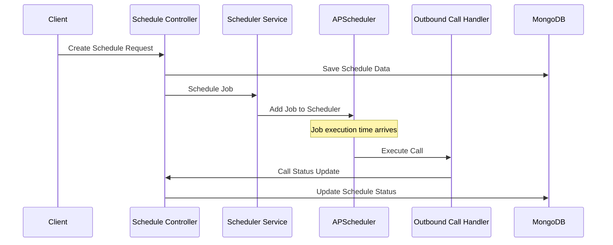
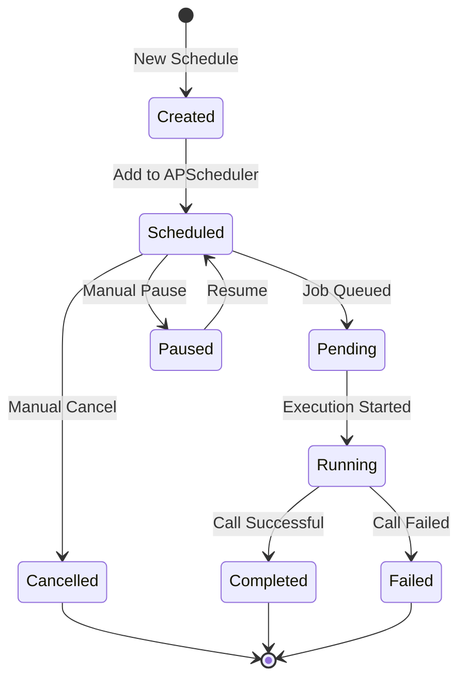
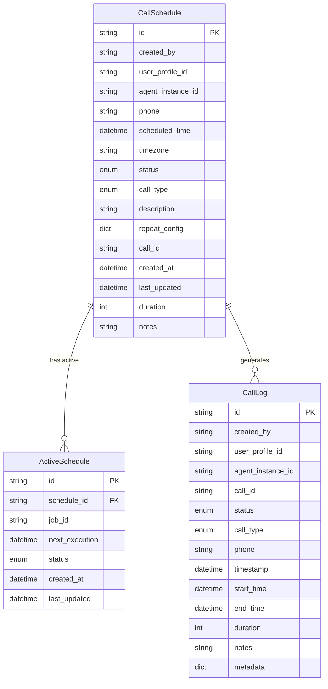
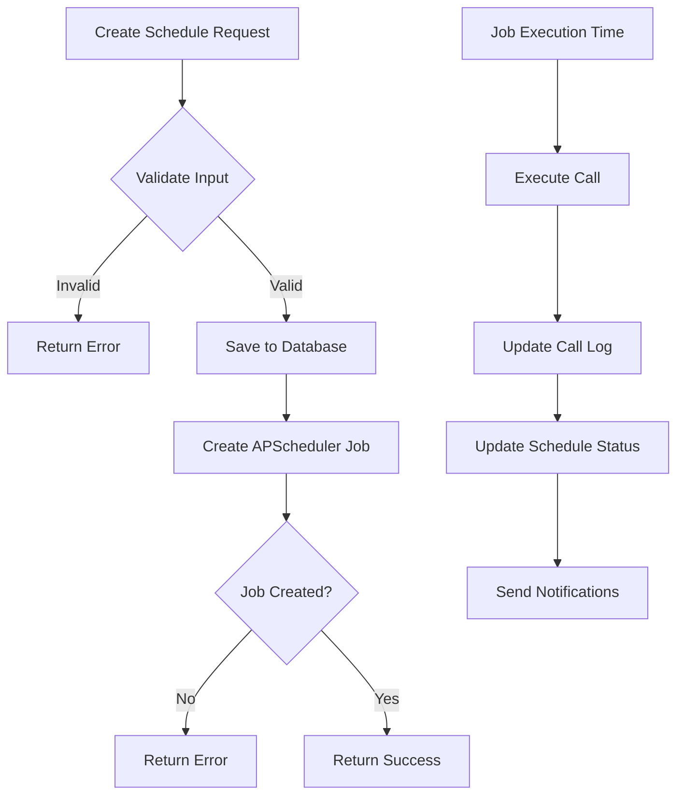
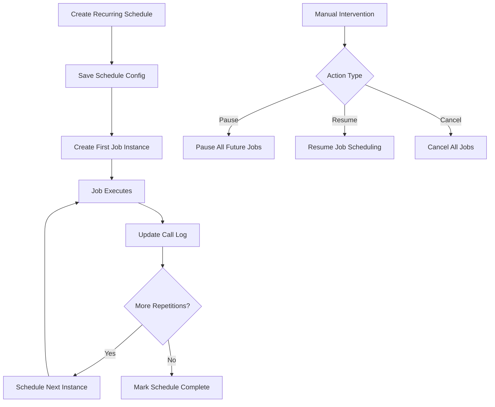
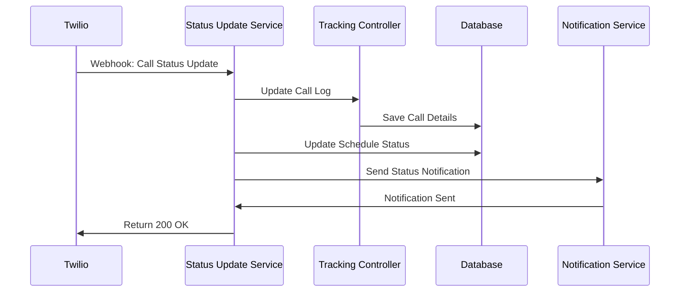
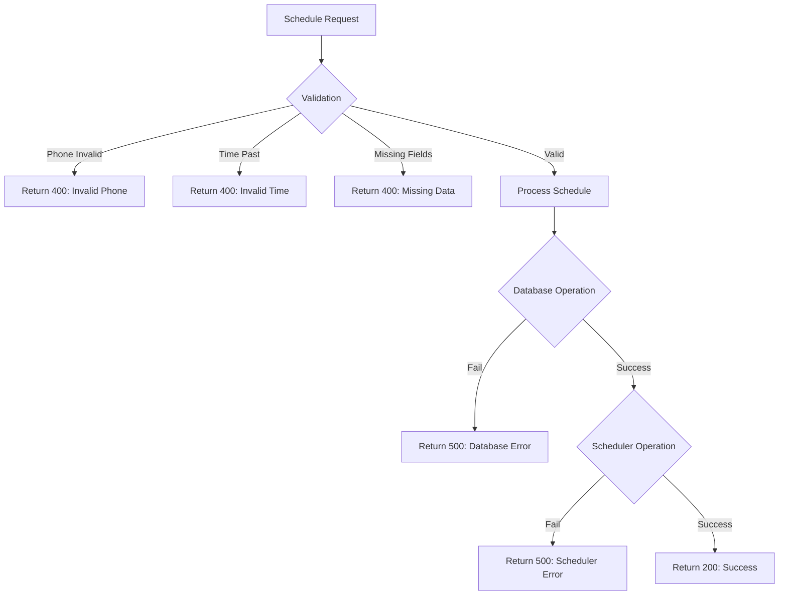

# Schedule Module Documentation

## Overview

The Schedule Module is a comprehensive call scheduling system that manages automated outbound calls using advanced scheduling capabilities, real-time tracking, and seamless integration with Twilio. Built with APScheduler for robust job scheduling, this module provides both one-time and recurring call scheduling functionality.

## Architecture Overview



## Core Components

### 1. Controllers

#### Schedule Controller (`controller/schedule.py`)
The main controller responsible for managing call schedules and orchestrating the scheduling workflow.

**Key Responsibilities:**
- Creating and managing call schedules
- Integrating with APScheduler for job management
- Handling recurring schedules with repeat logic
- Managing schedule lifecycle (pause, resume, cancel)



#### Tracking Controller (`controller/tracking.py`)
Manages call logs, statistics, and tracking functionality for all scheduled calls.

**Key Responsibilities:**
- Creating and updating call logs
- Generating call statistics and reports
- Managing call history and tracking data
- Providing analytics and insights

### 2. Services

#### Scheduler Service (`services/scheduler_service.py`)
Core scheduling service using APScheduler for robust job management.

**Features:**
- **Job Scheduling**: Single and recurring call scheduling
- **Timezone Handling**: UTC-based scheduling with timezone conversion
- **Misfire Handling**: Graceful handling of missed executions
- **Job Management**: Pause, resume, cancel operations



#### Status Update Service (`services/status_update_service.py`)
Handles call status updates from Twilio webhooks and coordinates updates across the system.

**Key Functions:**
- Processing Twilio webhook events
- Updating call logs and schedules
- Status mapping between Twilio and internal states
- Creating call logs from webhook data

#### Notification Service (`services/notification_service.py`)
Event-driven notification system for schedule-related events.

**Capabilities:**
- Event handler registration
- Notification dispatching
- Support for multiple notification channels
- Extensible notification system

### 3. Data Models



## API Endpoints

### Schedule Management

#### Create Schedule
```http
POST /schedule/
```

**Request Body:**
```json
{
    "phone": "+1234567890",
    "scheduled_time": "2024-01-15T10:00:00Z",
    "timezone": "America/New_York",
    "description": "Follow-up call",
    "call_type": "outbound",
    "repeat_config": {
        "enabled": true,
        "frequency": "daily",
        "end_date": "2024-02-15T10:00:00Z"
    }
}
```

**Response:**
```json
{
    "status": "success",
    "message": "Call scheduled successfully",
    "schedule_id": "schedule_123",
    "next_execution": "2024-01-15T10:00:00Z"
}
```

#### Update Schedule
```http
PUT /schedule/{schedule_id}
```

#### Get Schedule
```http
GET /schedule/{schedule_id}
```

#### Delete Schedule
```http
DELETE /schedule/{schedule_id}
```

### Schedule Control

#### Pause Schedule
```http
POST /schedule/{schedule_id}/pause
```

#### Resume Schedule
```http
POST /schedule/{schedule_id}/resume
```

#### Cancel Schedule
```http
POST /schedule/{schedule_id}/cancel
```

### Tracking and Analytics

#### Get Call Logs
```http
GET /schedule/tracking/logs
```

**Query Parameters:**
- `user_profile_id`: Filter by user
- `status`: Filter by call status
- `start_date`: Date range start
- `end_date`: Date range end
- `limit`: Number of results
- `offset`: Pagination offset

#### Get Call Statistics
```http
GET /schedule/tracking/stats
```

**Response:**
```json
{
    "total_calls": 150,
    "completed_calls": 120,
    "failed_calls": 20,
    "pending_calls": 10,
    "success_rate": 80.0,
    "average_duration": 180,
    "total_duration": 21600
}
```

## Scheduling Workflows

### One-Time Call Scheduling



### Recurring Call Scheduling



### Status Update Workflow



## Configuration and Setup

### Environment Variables

```bash
# APScheduler Configuration
SCHEDULER_TIMEZONE=UTC
SCHEDULER_MAX_INSTANCES=3
SCHEDULER_MISFIRE_GRACE_TIME=300

# Database Configuration
MONGODB_URL=mongodb://localhost:27017
DATABASE_NAME=polaris_db

# Twilio Configuration
TWILIO_ACCOUNT_SID=your_account_sid
TWILIO_AUTH_TOKEN=your_auth_token
TWILIO_WEBHOOK_URL=https://your-domain/webhook/call-status
```

### Database Collections

#### call_schedules
```javascript
{
    "_id": ObjectId,
    "id": "schedule_123",
    "created_by": "user_456",
    "user_profile_id": "profile_789",
    "agent_instance_id": "agent_001",
    "phone": "+1234567890",
    "scheduled_time": ISODate("2024-01-15T10:00:00Z"),
    "timezone": "America/New_York",
    "status": "scheduled",
    "call_type": "outbound",
    "description": "Follow-up call",
    "repeat_config": {
        "enabled": true,
        "frequency": "daily",
        "end_date": ISODate("2024-02-15T10:00:00Z")
    },
    "call_id": "call_789",
    "created_at": ISODate,
    "last_updated": ISODate
}
```

#### call_logs
```javascript
{
    "_id": ObjectId,
    "id": "log_123",
    "created_by": "user_456",
    "user_profile_id": "profile_789",
    "agent_instance_id": "agent_001",
    "call_id": "call_789",
    "status": "completed",
    "call_type": "outbound",
    "phone": "+1234567890",
    "timestamp": ISODate,
    "start_time": ISODate,
    "end_time": ISODate,
    "duration": 180,
    "notes": "Call completed successfully",
    "metadata": {}
}
```

## Error Handling and Monitoring

### Common Error Scenarios



### Error Response Format

```json
{
    "status": "error",
    "message": "Detailed error description",
    "error_code": "SCHEDULE_001",
    "details": {
        "field": "phone",
        "issue": "Invalid phone number format"
    },
    "timestamp": "2024-01-15T10:00:00Z"
}
```

### Monitoring and Logging

- **APScheduler Events**: Job execution, failures, misfires
- **Database Operations**: CRUD operations, connection issues
- **Twilio Integration**: Webhook processing, API calls
- **Performance Metrics**: Response times, success rates

## Testing Guide

### Unit Testing

```python
# Example test for schedule creation
async def test_create_schedule():
    schedule_data = {
        "phone": "+1234567890",
        "scheduled_time": "2024-01-15T10:00:00Z",
        "description": "Test call"
    }
    
    response = await client.post("/schedule/", json=schedule_data)
    assert response.status_code == 200
    assert response.json()["status"] == "success"
```

### Integration Testing

```python
# Example test for end-to-end scheduling
async def test_schedule_execution():
    # Create schedule
    schedule = await create_test_schedule()
    
    # Wait for execution
    await asyncio.sleep(schedule_delay)
    
    # Verify call log created
    call_log = await get_call_log(schedule.call_id)
    assert call_log.status == CallStatus.COMPLETED
```

### Load Testing

- Test concurrent schedule creation
- Verify APScheduler performance under load
- Monitor database connection pooling
- Test webhook handling capacity

## Troubleshooting

### Common Issues

#### 1. Jobs Not Executing
**Symptoms:** Scheduled jobs remain in "scheduled" status
**Causes:**
- APScheduler not started
- Timezone configuration issues
- Job misfire grace time exceeded

**Solutions:**
```python
# Check scheduler status
scheduler_service = SchedulerService()
jobs = await scheduler_service.get_all_jobs()
print(f"Active jobs: {len(jobs)}")

# Verify timezone configuration
import pytz
utc_time = datetime.now(pytz.UTC)
print(f"Current UTC time: {utc_time}")
```

#### 2. Webhook Processing Failures
**Symptoms:** Call status not updating after completion
**Causes:**
- Webhook URL not configured in Twilio
- Authentication failures
- Database connection issues

**Solutions:**
- Verify Twilio webhook configuration
- Check webhook endpoint logs
- Test webhook endpoint manually

#### 3. Database Connection Issues
**Symptoms:** Schedule creation fails with database errors
**Solutions:**
- Check MongoDB connection string
- Verify database permissions
- Monitor connection pool status

### Debug Commands

```bash
# Check active schedules
curl -X GET "http://localhost:8000/schedule/active"

# Get call logs
curl -X GET "http://localhost:8000/schedule/tracking/logs?limit=10"

# Check specific schedule
curl -X GET "http://localhost:8000/schedule/{schedule_id}"

# Get scheduler statistics
curl -X GET "http://localhost:8000/schedule/tracking/stats"
```

## Performance Optimization

### Best Practices

1. **Batch Operations**: Group multiple schedule operations
2. **Database Indexing**: Index frequently queried fields
3. **Connection Pooling**: Optimize database connections
4. **Caching**: Cache frequently accessed data
5. **Monitoring**: Implement comprehensive logging

### Scaling Considerations

- **Horizontal Scaling**: Multiple scheduler instances
- **Database Sharding**: Partition by user or time
- **Job Distribution**: Distribute jobs across instances
- **Load Balancing**: Balance webhook processing

## Security Considerations

### Authentication and Authorization

- JWT-based authentication for API endpoints
- User-level access control for schedules
- Agent instance isolation
- Webhook signature verification

### Data Protection

- Encryption at rest for sensitive data
- Secure transmission of phone numbers
- Audit logging for all operations
- PII data handling compliance

## Future Enhancements

### Planned Features

1. **Advanced Scheduling**: Support for complex scheduling rules
2. **Retry Logic**: Automatic retry for failed calls
3. **Bulk Operations**: Mass schedule creation and management
4. **Analytics Dashboard**: Real-time scheduling analytics
5. **Integration APIs**: Third-party system integration
6. **Mobile Support**: Mobile app integration

### Technical Improvements

- **Event Sourcing**: Complete audit trail
- **Microservices**: Split into dedicated services
- **GraphQL API**: Alternative API interface
- **Real-time Updates**: WebSocket-based live updates