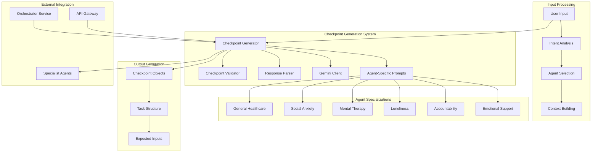
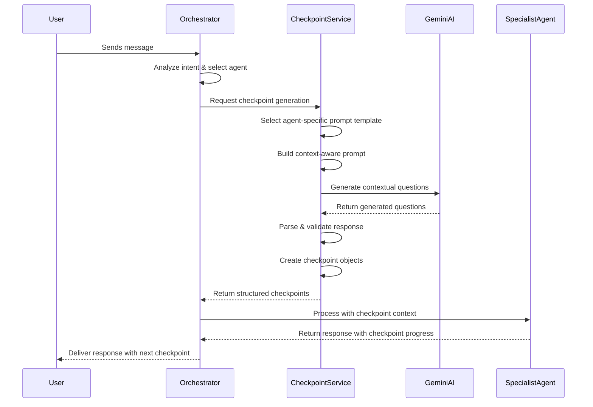

# Checkpoint Generator Service Documentation

## Overview

The Checkpoint Generator Service is an intelligent conversation flow management system that creates dynamic, context-aware checkpoints for medical and therapeutic conversations. It acts as the "conversation director," generating appropriate follow-up questions and conversation paths based on user intent, agent specialization, and conversation history.

### What It Does

The service transforms basic user inputs into structured conversation flows by:
- **Analyzing User Intent**: Understanding what type of support or information the user needs
- **Generating Contextual Questions**: Creating relevant follow-up questions based on conversation history
- **Managing Conversation Flow**: Organizing questions into logical sequences that guide meaningful interactions
- **Supporting Multiple Agent Types**: Providing specialized conversation paths for different types of support agents

### Why It's Important

Without structured conversation flows, AI agents might ask random or repetitive questions, leading to frustrating user experiences. The Checkpoint Generator ensures that every conversation follows a logical, purpose-driven path that maximizes the value of each interaction.

## System Architecture



## Core Components

### 1. Agent-Specific Prompt Generator

The heart of the system lies in its ability to generate specialized conversation prompts based on different types of support needed.

**Supported Agent Types:**

**Emotional Support Specialist**
- **Focus**: Grief counseling, bereavement support, terminal illness coping, emotional healing
- **Approach**: Validates feelings, explores coping mechanisms, assesses emotional safety
- **Question Types**: Supportive, empathetic, focused on emotional processing and healing

**Accountability Partner**
- **Focus**: Habit formation, addiction recovery, behavior change, commitment maintenance
- **Approach**: Sets measurable goals, identifies triggers, establishes tracking systems
- **Question Types**: Goal-oriented, progress-focused, motivational with clear action steps

**Loneliness Companion**
- **Focus**: Building meaningful relationships, reducing isolation, fostering social connections
- **Approach**: Explores social connections, identifies social activities, addresses confidence
- **Question Types**: Relationship-building, activity-planning, confidence-boosting

**Mental Therapy Support**
- **Focus**: Anxiety management, depression support, trauma processing, mental health coping
- **Approach**: Assesses symptoms, explores therapeutic goals, identifies coping strategies
- **Question Types**: Clinical but compassionate, solution-focused, safety-oriented

**Social Anxiety Coach**
- **Focus**: Social anxiety management, presentation skills, interview preparation, confidence building
- **Approach**: Understands anxiety triggers, practices techniques, creates preparation plans
- **Question Types**: Skill-building, practice-oriented, step-by-step guidance

### 2. Context-Aware Generation

The system intelligently adapts its question generation based on conversation history:

**First Interaction (No Context)**
- Generates exploratory questions to understand the user's situation
- Focuses on gathering essential information for the specific agent type
- Creates foundation for ongoing conversation relationship

**Follow-up Interactions (With Context)**
- References previous conversations and responses
- Avoids repeating already-answered questions
- Builds upon information gathered in earlier sessions
- Deepens the conversation based on established rapport

### 3. Intelligent Response Processing

The service includes sophisticated parsing capabilities to handle various response formats:

**JSON Response Processing**
- Parses structured JSON responses from the AI generator
- Validates checkpoint structure and expected inputs
- Normalizes data format for consistent processing

**Text Response Fallback**
- Handles cases where AI returns unstructured text instead of JSON
- Extracts meaningful questions from narrative responses
- Converts text into proper checkpoint structure

**Error Recovery**
- Provides fallback questions when generation fails
- Ensures conversation can continue even with technical issues
- Maintains user experience quality during service problems

## Data Models and Structure

### Checkpoint Structure

Each checkpoint represents a specific conversation point with clear expectations:

**Core Properties:**
- **Text**: The actual question or statement presented to the user
- **Status**: Current state (pending, in_progress, complete)
- **Expected Inputs**: List of information types expected from the user
- **Collected Inputs**: Information actually gathered from user responses

**Example Checkpoint:**
```
Text: "Can you tell me more about what's been making you feel lonely lately?"
Status: "pending"
Expected Inputs: ["emotional_triggers", "social_situations", "isolation_factors"]
Collected Inputs: []
```

### Task Organization

Checkpoints are organized into Tasks that represent complete conversation flows:

**Task Properties:**
- **Task ID**: Unique identifier for the conversation flow
- **Label**: Human-readable description of the task purpose
- **Source**: Type of task (Main, SupportAgent, Interrupt)
- **Checklist**: Array of checkpoint objects
- **Current Index**: Which checkpoint is currently active
- **Status**: Whether the task is active or completed

**Task Flow Management:**
- Tasks progress sequentially through their checkpoints
- Completed checkpoints unlock the next questions
- Multiple tasks can exist simultaneously for complex conversations

### Expected Input Types

The system defines specific input categories for each agent type to ensure comprehensive information gathering:

**Emotional Support Inputs:**
- grief_stage, support_system, coping_mechanisms, emotional_state, memories, concerns

**Accountability Inputs:**
- goals, triggers, habits, progress, challenges, commitment_level, accountability_frequency

**Loneliness Support Inputs:**
- social_circle, interests, barriers, confidence_level, social_goals, preferred_activities

**Mental Therapy Inputs:**
- symptoms, triggers, coping_strategies, therapy_history, medication, crisis_plan, goals

**Social Anxiety Inputs:**
- anxiety_triggers, physical_symptoms, preparation_needs, practice_opportunities, confidence_level, specific_event

## API Endpoints

### 1. Checkpoint Generation Endpoint

**Endpoint**: `POST /generate`

**Purpose**: Creates contextual conversation checkpoints based on user input and conversation history.

**When to Use**: 
- Starting a new conversation with a user
- Continuing an existing conversation with additional context
- Switching conversation focus or agent type

**Request Parameters:**

- **text** (required): The user's current message or input
- **conversation_id** (required): Unique identifier for this conversation session
- **task_type** (optional): Type of checkpoint task (Main, SupportAgent, Interrupt)
- **context** (optional): Previous conversation exchanges for context
- **limit** (optional): Maximum number of checkpoints to generate (default: 2)
- **existing_task_id** (optional): ID of existing task to update rather than create new
- **detected_intent** (optional): Specific intent detected by other system components
- **agent_type** (optional): Type of specialist agent handling this conversation
- **conversation_context** (optional): Complete conversation history for better context understanding

**Example Request:**
```json
{
  "text": "I've been feeling really lonely lately and don't know what to do about it",
  "conversation_id": "conv_12345",
  "task_type": "Main",
  "limit": 2,
  "detected_intent": "loneliness",
  "agent_type": "loneliness",
  "context": [
    {
      "role": "user",
      "content": "I've been struggling with feeling isolated"
    },
    {
      "role": "assistant", 
      "content": "I understand that feeling isolated can be really difficult. Can you tell me more about your current situation?"
    }
  ]
}
```

**Response Structure:**
```json
{
  "task": {
    "task_id": "task_conv_12345_20250915143022",
    "label": "Task generated from: I've been feeling really lonely lately...",
    "source": "Main",
    "checklist": [
      {
        "name": "Can you tell me more about your current social connections? Do you have family, friends, or colleagues you're in regular contact with?",
        "status": "pending",
        "expected_inputs": ["social_circle", "family_connections", "friend_network"],
        "collected_inputs": []
      },
      {
        "name": "What kinds of activities or interests do you have that might help you meet like-minded people?",
        "status": "pending", 
        "expected_inputs": ["interests", "hobbies", "preferred_activities"],
        "collected_inputs": []
      }
    ],
    "current_checkpoint_index": 0,
    "is_active": true
  },
  "checkpoints": [...],
  "timestamp": "2025-09-15T14:30:22.123Z",
  "is_new_task": true
}
```

### 2. Health Check Endpoint

**Endpoint**: `GET /health`

**Purpose**: Monitors service health and availability

**Response:**
```json
{
  "status": "healthy",
  "service": "checkpoint",
  "version": "1.0.0",
  "environment": "development",
  "timestamp": "2025-09-15T14:30:22.123Z"
}
```

## Generation Process Flow

### Complete Checkpoint Generation Journey



### Internal Generation Process

**Step 1: Input Analysis**
- Receive user message and conversation context
- Identify the appropriate agent type and specialization
- Determine if this is a new conversation or continuation

**Step 2: Template Selection**
- Select the appropriate prompt template based on agent type
- Customize the template with conversation-specific context
- Include relevant conversation history and user information

**Step 3: AI Generation**
- Send the crafted prompt to Gemini AI
- Request structured JSON response with specific checkpoint format
- Handle potential API timeouts or errors gracefully

**Step 4: Response Processing**
- Parse the AI response (JSON or text format)
- Validate checkpoint structure and content quality
- Normalize expected input categories and naming

**Step 5: Object Creation**
- Create proper Checkpoint objects with all required fields
- Organize checkpoints into a Task structure
- Set appropriate status and tracking information

**Step 6: Quality Assurance**
- Ensure questions are appropriate for the agent type
- Verify no duplicate or inappropriate questions
- Confirm expected inputs match the conversation goals

## Agent Specialization Details

### How Agent-Specific Generation Works

**Template-Based Approach**
Each agent type has a carefully crafted template that defines:
- The role the AI should assume (e.g., "compassionate emotional support specialist")
- The specific focus area (e.g., "grief counseling, bereavement support")
- Key question categories that are most effective for that specialization
- Expected input types that provide the most valuable information

**Context Integration**
The system seamlessly blends agent specialization with conversation context:
- **New Conversations**: Focuses on exploratory questions specific to the agent type
- **Ongoing Conversations**: References previous exchanges while maintaining agent focus
- **Context Switching**: Can adapt when conversation moves between different support needs

**Quality Guidelines**
All generated checkpoints follow strict quality standards:
- Conversational and empathetic tone appropriate for the situation
- Professional boundaries maintained for therapeutic contexts
- Questions flow naturally from previous conversation points
- Sensitive topics handled with appropriate care and expertise

### Emotional Support Specialization

**Unique Characteristics:**
- Focuses heavily on validation and emotional safety
- Explores coping mechanisms and support systems
- Assesses immediate emotional needs before deeper exploration
- Uses trauma-informed language and approaches

**Example Questions:**
- "It sounds like you're going through something really difficult. Can you help me understand what you're experiencing right now?"
- "Who in your life provides emotional support during challenging times like this?"
- "What has helped you cope with difficult emotions in the past?"

### Accountability Specialization

**Unique Characteristics:**
- Emphasizes goal-setting and measurable outcomes
- Identifies specific triggers and prevention strategies
- Establishes clear accountability systems and check-ins
- Focuses on building sustainable habits and motivation

**Example Questions:**
- "What specific goal would you like to work on together, and how will we know when you've achieved it?"
- "What situations or feelings typically trigger the behavior you want to change?"
- "How often would you like me to check in with you about your progress?"

### Loneliness Specialization

**Unique Characteristics:**
- Explores current social connections and relationship quality
- Identifies interests that could lead to social opportunities
- Addresses social anxiety and confidence barriers
- Creates actionable plans for increasing social engagement

**Example Questions:**
- "Tell me about the people in your life right now - family, friends, colleagues, neighbors?"
- "What activities or hobbies bring you joy that might also be opportunities to meet others?"
- "What feels most challenging about reaching out to others or making new connections?"

## Integration with Other Services

### Orchestrator Service Integration

The Checkpoint Service works closely with the Orchestrator to manage conversation flows:

**Request Flow:**
1. Orchestrator receives user message
2. Analyzes intent and selects appropriate specialist agent
3. Requests checkpoints from Checkpoint Service with detected intent and agent type
4. Receives structured checkpoints for conversation guidance
5. Passes checkpoints to specialist agent for context-aware processing

**Information Sharing:**
- **Intent Detection**: Orchestrator shares detected user intent with Checkpoint Service
- **Agent Selection**: Chosen specialist agent type influences checkpoint generation
- **Conversation Context**: Full conversation history provides context for checkpoint relevance
- **Progress Tracking**: Checkpoint completion status helps Orchestrator manage conversation flow

### Specialist Agent Integration

Each specialist agent uses checkpoints to guide their conversation approach:

**Context Enhancement:**
- Agents receive checkpoint context along with user messages
- Current checkpoint informs agent response style and focus
- Expected inputs guide what information agents should gather
- Checkpoint progress helps agents understand conversation stage

**Progress Reporting:**
- Agents report checkpoint completion back to the system
- Collected inputs are tracked against expected information
- Checkpoint status updates enable conversation advancement
- Failed or incomplete checkpoints trigger alternative approaches

### Caching and Performance Integration

The service integrates with the system's caching layer for optimal performance:

**Checkpoint Evaluation Caching:**
- Recently completed checkpoint evaluations are cached
- Prevents redundant processing for similar conversation patterns
- Improves response times for common conversation flows
- Reduces AI API usage through intelligent caching

**Context Sharing:**
- Conversation context is efficiently shared between services
- User profile information informs checkpoint personalization
- Session state maintains checkpoint progress across interactions

## Performance and Reliability

### Response Time Optimization

**Fast Generation Strategies:**
- Pre-defined agent templates reduce prompt construction time
- Efficient JSON parsing with text fallback for reliability
- Caching of frequently generated checkpoint patterns
- Parallel processing where possible

**Error Handling:**
- Graceful degradation when AI services are unavailable
- Fallback checkpoint generation for service continuity
- Retry mechanisms for temporary API failures
- Default questions ensure conversation can always continue

### Quality Assurance

**Generated Content Validation:**
- Automatic validation of checkpoint structure and format
- Content appropriateness checking for different agent types
- Duplicate question detection and elimination
- Expected input validation and normalization

**Continuous Improvement:**
- Monitoring of checkpoint effectiveness and user engagement
- Analysis of conversation completion rates
- Feedback loop for prompt template optimization
- Regular review of agent specialization accuracy

## Testing and Validation

### Functional Testing

**Basic Generation Testing:**
Test the service's ability to generate appropriate checkpoints for different scenarios:

**New Conversation Test:**
```bash
curl -X POST http://localhost:8003/generate \
  -H "Content-Type: application/json" \
  -d '{
    "text": "I have been feeling really anxious about my upcoming job interview",
    "conversation_id": "test_001",
    "detected_intent": "social_anxiety",
    "agent_type": "social_anxiety",
    "limit": 2
  }'
```

**Contextual Generation Test:**
```bash
curl -X POST http://localhost:8003/generate \
  -H "Content-Type: application/json" \
  -d '{
    "text": "The interview is next week and I am getting more nervous",
    "conversation_id": "test_001", 
    "context": [
      {"role": "user", "content": "I have been feeling really anxious about my upcoming job interview"},
      {"role": "assistant", "content": "I understand that job interviews can feel overwhelming. Can you tell me more about what specifically worries you about this interview?"}
    ],
    "detected_intent": "social_anxiety",
    "agent_type": "social_anxiety",
    "limit": 2
  }'
```

### Agent Specialization Testing

**Test Each Agent Type:**
Verify that each agent specialization generates appropriate, contextual questions:

**Emotional Support Test:**
- Input: "My mother passed away last month and I don't know how to cope"
- Expected: Grief-focused, validation-oriented questions
- Verify: Questions about support systems, coping mechanisms, memorial activities

**Accountability Test:**
- Input: "I keep trying to quit smoking but I always start again after a few days"
- Expected: Goal-setting, trigger identification, accountability planning questions
- Verify: Questions about specific triggers, quit strategies, progress tracking

**Loneliness Test:**
- Input: "I moved to a new city and I don't know anyone here"
- Expected: Social connection, activity-based, community engagement questions
- Verify: Questions about interests, local activities, social barriers

### Integration Testing

**Orchestrator Integration:**
Test the complete flow from user input through orchestrator to checkpoint generation:

```python
# Test orchestrator -> checkpoint service integration
async def test_orchestrator_checkpoint_flow():
    # Simulate orchestrator request to checkpoint service
    orchestrator_request = {
        "text": "I've been struggling with depression lately",
        "conversation_id": "integration_test_001",
        "detected_intent": "mental_therapy", 
        "agent_type": "mental_therapy",
        "context": []
    }
    
    # Send request and verify response structure
    response = await checkpoint_service.generate(orchestrator_request)
    
    assert response.task.source == "Main"
    assert len(response.checkpoints) == 2
    assert all(cp.status == "pending" for cp in response.checkpoints)
    assert response.is_new_task == True
```

### Load and Stress Testing

**Concurrent Generation Testing:**
```python
import asyncio
import aiohttp

async def load_test_checkpoint_generation():
    """Test checkpoint service under concurrent load"""
    
    async def single_generation_test(session, test_id):
        url = "http://localhost:8003/generate"
        payload = {
            "text": f"Test anxiety message {test_id}",
            "conversation_id": f"load_test_{test_id}",
            "detected_intent": "social_anxiety",
            "limit": 2
        }
        
        async with session.post(url, json=payload) as response:
            return await response.json()
    
    # Test 100 concurrent requests
    async with aiohttp.ClientSession() as session:
        tasks = [single_generation_test(session, i) for i in range(100)]
        results = await asyncio.gather(*tasks, return_exceptions=True)
    
    # Analyze results
    successful = [r for r in results if not isinstance(r, Exception)]
    failed = [r for r in results if isinstance(r, Exception)]
    
    print(f"Load test results: {len(successful)} successful, {len(failed)} failed")
```

## Deployment and Configuration

### Environment Setup

**Required Environment Variables:**
```bash
# Core Configuration
GEMINI_API_KEY=your_gemini_api_key_here
SERVICE_PORT=8003
SERVICE_HOST=0.0.0.0
ENVIRONMENT=production

# Service Information
SERVICE_NAME=checkpoint
SERVICE_VERSION=1.0.0
```

**Optional Configuration:**
```bash
# Performance Tuning
DEFAULT_CHECKPOINT_LIMIT=2
GENERATION_TIMEOUT=30
AI_RETRY_ATTEMPTS=3

# Quality Settings
MIN_CHECKPOINT_LENGTH=10
MAX_CHECKPOINT_LENGTH=500
ENABLE_CONTENT_FILTERING=true
```

### Health Monitoring

**Service Health Indicators:**
- **Response Time**: Checkpoint generation should complete within 5 seconds
- **Success Rate**: At least 95% of requests should generate valid checkpoints
- **AI Service Connectivity**: Gemini API should be accessible and responsive
- **Content Quality**: Generated checkpoints should pass validation checks

**Monitoring Script:**
```python
import requests
import time

def monitor_checkpoint_service():
    """Monitor checkpoint service health and performance"""
    
    health_url = "http://localhost:8003/health"
    test_url = "http://localhost:8003/generate"
    
    while True:
        try:
            # Health check
            health_response = requests.get(health_url, timeout=5)
            if health_response.status_code == 200:
                print(f"✅ Service healthy at {time.strftime('%Y-%m-%d %H:%M:%S')}")
            else:
                print(f"⚠️ Health check failed: {health_response.status_code}")
            
            # Functional test
            test_payload = {
                "text": "Test anxiety message",
                "conversation_id": "monitor_test",
                "detected_intent": "social_anxiety",
                "limit": 1
            }
            
            start_time = time.time()
            test_response = requests.post(test_url, json=test_payload, timeout=10)
            response_time = time.time() - start_time
            
            if test_response.status_code == 200:
                result = test_response.json()
                if result.get("task") and result.get("checkpoints"):
                    print(f"✅ Functional test passed in {response_time:.2f}s")
                else:
                    print(f"⚠️ Functional test failed: Invalid response structure")
            else:
                print(f"❌ Functional test failed: {test_response.status_code}")
                
        except Exception as e:
            print(f"❌ Monitor error: {e}")
        
        time.sleep(60)  # Check every minute

monitor_checkpoint_service()
```

### Scaling and Performance

**Horizontal Scaling:**
- Multiple checkpoint service instances can run simultaneously
- Load balancing distributes generation requests across instances
- Stateless design allows for easy horizontal scaling
- Shared AI API rate limits may require coordination

**Performance Optimization:**
- Template caching reduces prompt construction time
- Response parsing optimization for faster checkpoint creation
- Connection pooling for external AI service calls
- Intelligent retry and fallback mechanisms

**Resource Requirements:**
- **Memory**: 1-2GB per instance for optimal performance
- **CPU**: Multi-core recommended for concurrent request handling
- **Network**: Reliable connection to AI services (Gemini API)
- **Storage**: Minimal - service is stateless with no persistent data


## Conclusion

The Checkpoint Generator Service is a sophisticated conversation management system that brings structure and intelligence to AI-powered therapeutic and support conversations. By combining agent specialization expertise with context-aware generation, it ensures that every conversation follows a meaningful, purpose-driven path.

The service's strength lies in its ability to adapt to different types of support needs while maintaining consistency in conversation quality. Whether helping someone process grief, build accountability habits, overcome loneliness, manage mental health challenges, or prepare for anxiety-inducing situations, the Checkpoint Generator creates the conversational framework that enables deep, meaningful support.

Through careful implementation of best practices around content quality, technical performance, and system integration, the Checkpoint Generator Service provides the foundation for transformative AI-powered support experiences that genuinely help people navigate life's challenges with appropriate, expert guidance.