# Orchestrator Architecture Documentation

## Overview

The Orchestrator is the central coordination service in the Polaris conversational AI platform. It acts as the brain of the system, managing conversation flows, coordinating agent interactions, handling checkpoint progression, and orchestrating complex multi-service conversations. Built with FastAPI and designed for high-performance async operations, the orchestrator ensures seamless communication between all platform components.

## System Architecture

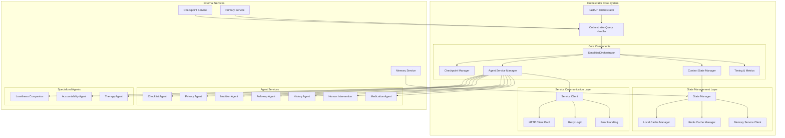

## Core Components

### 1. SimplifiedOrchestrator

The main orchestration engine that handles conversation flow and service coordination.

**Key Responsibilities:**
- **Conversation Flow Management**: Controls checkpoint progression and task management
- **Service Coordination**: Orchestrates calls to multiple agent services
- **Context Management**: Maintains conversation context and state
- **Performance Optimization**: Implements caching and efficient resource management

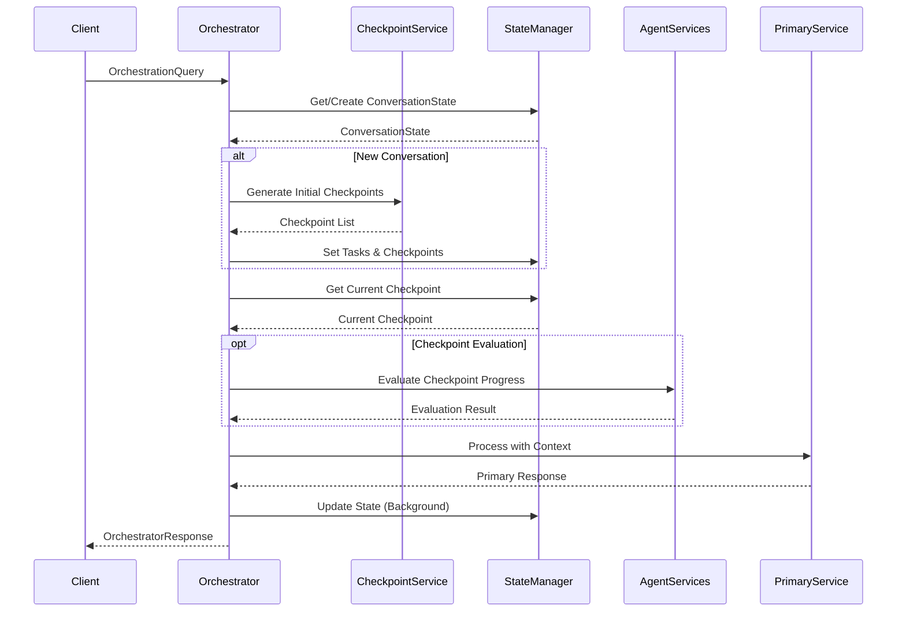

### 2. State Management System

Ultra-optimized conversation state management with multi-level caching.

**Features:**
- **Multi-Level Caching**: Local memory + Redis + API fallback
- **Incremental Updates**: Only save changed fields
- **Async Operations**: Non-blocking state updates
- **Performance Monitoring**: Detailed cache statistics

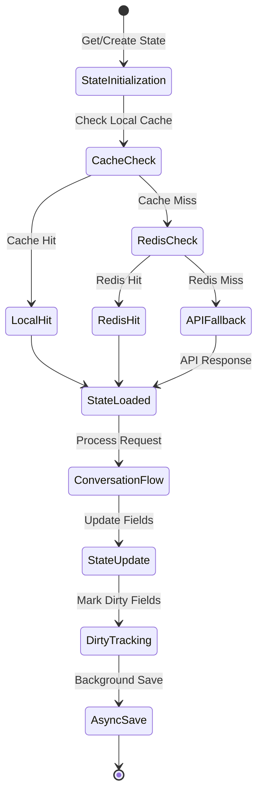

### 3. Service Communication Layer

Robust HTTP client management with advanced error handling and retry logic.

**Capabilities:**
- **Connection Pooling**: Optimized HTTP/2 connections
- **Dynamic Timeouts**: Service-specific timeout configurations
- **Intelligent Retries**: Exponential backoff with circuit breaker patterns
- **Error Classification**: Different handling for different error types

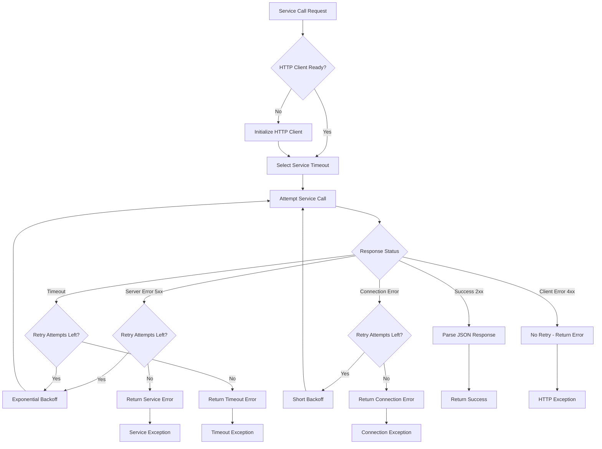

## Service Integration Architecture

### Agent Service Configuration

```python
AGENT_CONFIG = {
    "primary": {"port": 8004, "path": "/process", "type": "core", "dependencies": []},
    "checklist": {"port": 8007, "path": "/process", "type": "sync", "dependencies": []},
    "privacy": {"port": 8011, "path": "/process", "type": "sync", "dependencies": []},
    "nutrition": {"port": 8005, "path": "/process", "type": "sync", "dependencies": ["privacy", "followup"]},
    "followup": {"port": 8008, "path": "/process", "type": "sync", "dependencies": []},
    "history": {"port": 8009, "path": "/process", "type": "async", "dependencies": []},
    "human_intervention": {"port": 8006, "path": "/process", "type": "sync", "dependencies": []},
    "medication": {"port": 8012, "path": "/process", "type": "sync", "dependencies": []},
}
```

### Service Dependencies and Execution Flow

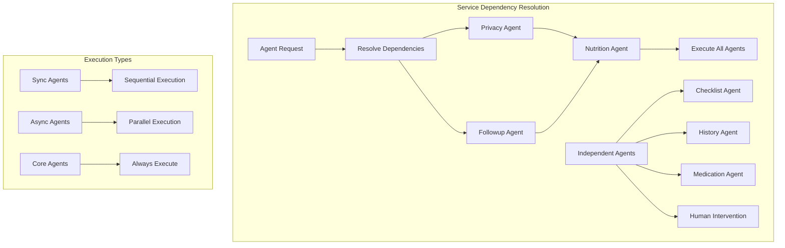

## Conversation Flow Management

### Checkpoint Lifecycle

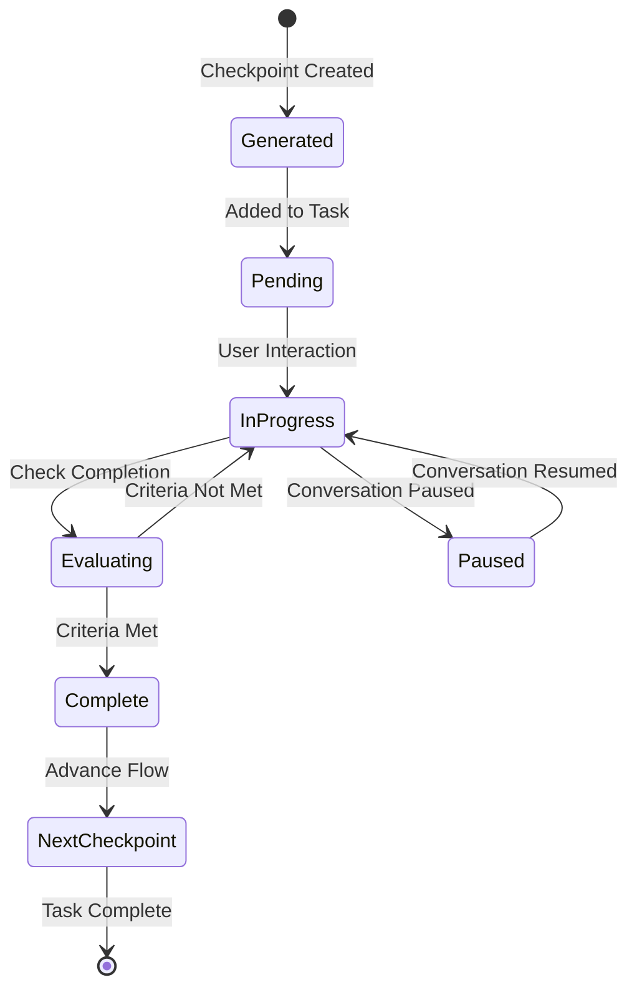

### Task Stack Management

The orchestrator manages multiple tasks simultaneously using a stack-based approach:

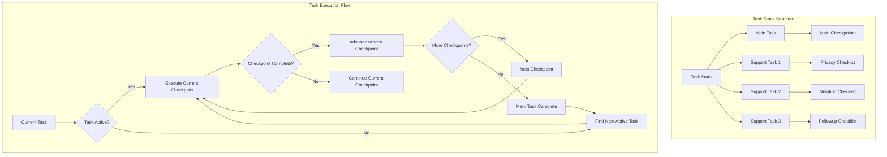

## Performance Optimizations

### Caching Strategy

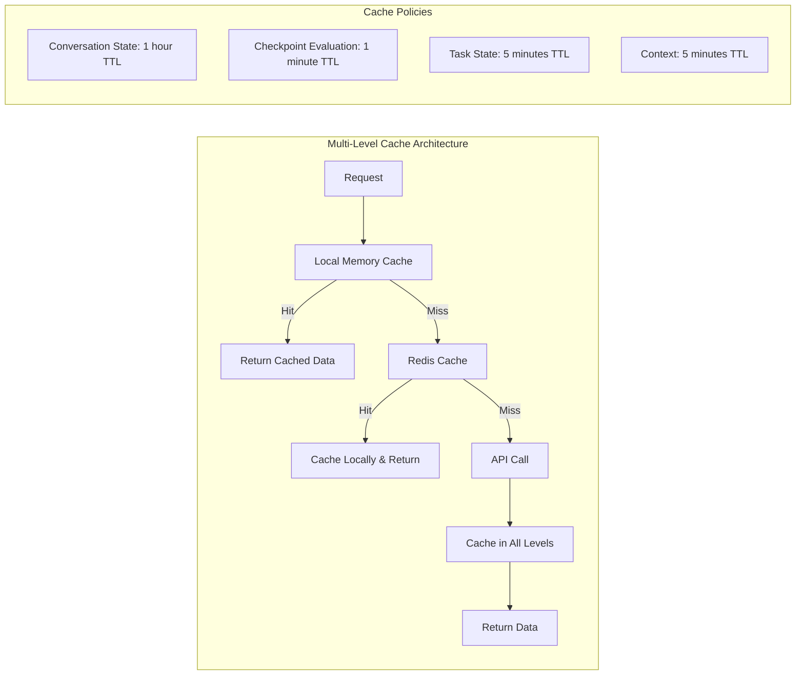

### HTTP Client Optimization

```python
# Optimized HTTP client configuration
limits = httpx.Limits(
    max_keepalive_connections=50,
    max_connections=200,
    keepalive_expiry=30.0
)

timeout = httpx.Timeout(
    connect=5.0,
    read=30.0,
    write=15.0,
    pool=10.0
)

http_client = httpx.AsyncClient(
    timeout=timeout,
    limits=limits,
    http2=True,  # Enable HTTP/2 for connection multiplexing
    transport=httpx.AsyncHTTPTransport(
        http2=True,
        retries=2
    )
)
```

## Error Handling and Resilience

### Circuit Breaker Pattern

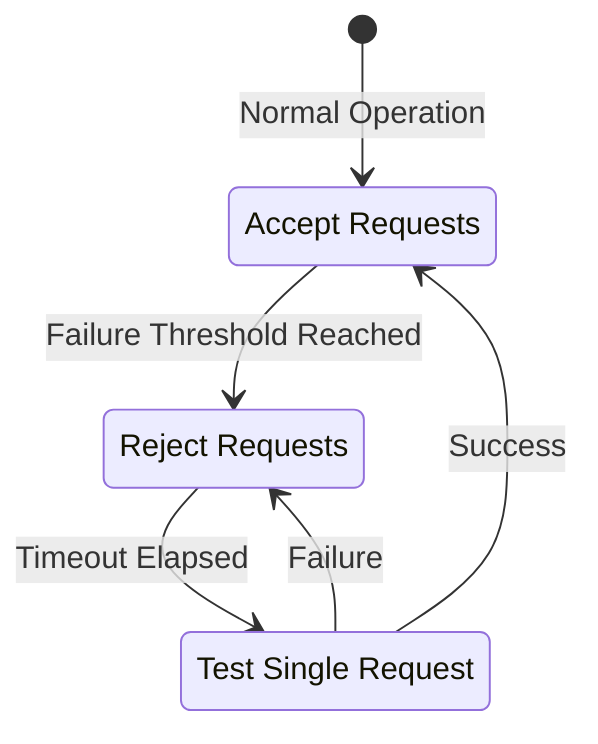

### Retry Logic Implementation

```python
async def call_service_with_retry(url, payload, max_retries=3):
    for attempt in range(max_retries + 1):
        try:
            if attempt > 0:
                # Exponential backoff
                await asyncio.sleep(0.5 * (2 ** (attempt - 1)))
            
            response = await http_client.post(url, json=payload)
            response.raise_for_status()
            return response.json()
            
        except httpx.HTTPStatusError as e:
            if e.response.status_code in [400, 401, 403, 404, 422]:
                break  # Don't retry client errors
        except httpx.TimeoutException:
            if attempt == max_retries:
                raise HTTPException(504, "Service timeout")
        except httpx.RequestError:
            if attempt > 0:
                break  # Don't retry connection errors beyond first attempt
    
    raise HTTPException(502, f"Service failed after {max_retries + 1} attempts")
```

## Monitoring and Observability

### Timing Metrics

The orchestrator provides detailed performance metrics for all operations:

```python
class TimingMetrics:
    def __init__(self):
        self.metrics = defaultdict(float)
        self.start_times = {}

    def start(self, step_name: str):
        self.start_times[step_name] = time.time()

    def end(self, step_name: str):
        if step_name in self.start_times:
            duration = time.time() - self.start_times[step_name]
            self.metrics[step_name] = round(duration * 1000, 2)  # milliseconds
```

### Performance Monitoring

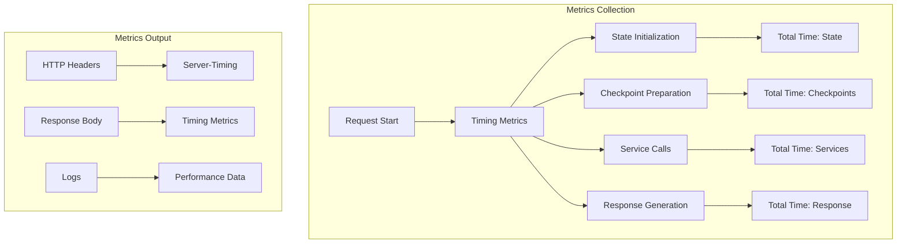

## Configuration Management

### Environment Configuration

```python
class OrchestratorSettings(BaseSettings):
    # Core Service URLs
    MEMORY_URL: str = "http://localhost:8010"
    CHECKPOINT_URL: str = "http://localhost:8003"
    PRIMARY_SERVICE_URL: str = "http://localhost:8004/process"
    
    # Agent Service URLs
    CHECKLIST_SERVICE_URL: str = "http://localhost:8007/process"
    PRIVACY_SERVICE_URL: str = "http://localhost:8011/process"
    NUTRITION_SERVICE_URL: str = "http://localhost:8005/process"
    
    # Performance Configuration
    HTTP_CONNECT_TIMEOUT: float = 5.0
    HTTP_READ_TIMEOUT: float = 30.0
    MAX_KEEPALIVE_CONNECTIONS: int = 50
    MAX_CONNECTIONS: int = 200
    
    # Cache Configuration
    REDIS_URL: str = "redis://localhost:6379"
    CACHE_TTL: int = 3600
    LOCAL_CACHE_SIZE: int = 1000
```

### Service-Specific Timeouts

```python
SERVICE_TIMEOUTS = {
    "default": httpx.Timeout(connect=5.0, read=30.0, write=15.0, pool=10.0),
    "human_intervention": httpx.Timeout(connect=3.0, read=10.0, write=10.0, pool=5.0),
    "checklist": httpx.Timeout(connect=3.0, read=15.0, write=10.0, pool=5.0),
    "primary_enriched": httpx.Timeout(connect=5.0, read=60.0, write=30.0, pool=15.0),
    "medication": httpx.Timeout(connect=5.0, read=45.0, write=20.0, pool=10.0),
    "privacy": httpx.Timeout(connect=5.0, read=45.0, write=20.0, pool=10.0),
}
```

## API Endpoints

### Main Orchestration Endpoint

```http
POST /orchestrate
```

**Request Model:**
```python
class OrchestratorQuery(BaseModel):
    text: str
    conversation_id: str
    plan: str
    services: List[str]
    individual_id: str
    user_profile_id: str
    detected_agent: str
    agent_instance_id: str
    call_log_id: str
    channel: Optional[str] = None
```

**Response Model:**
```python
class OrchestratorResponse(BaseModel):
    response: str
    conversation_id: str
    checkpoints: List[str]
    checkpoint_progress: Dict[str, bool]
    task_stack: List[Dict[str, Any]]
    sync_agent_results: Dict[str, List[AgentResult]]
    async_agent_results: Dict[str, Dict[str, Any]]
    requires_human: bool
    is_paused: bool
    is_enriched: bool
    timing_metrics: Dict[str, float]
```

### Health Check Endpoint

```http
GET /health
```

**Response:**
```json
{
    "status": "healthy",
    "service": "orchestrator",
    "version": "simplified"
}
```

## Integration Patterns

### Agent Detection and Routing

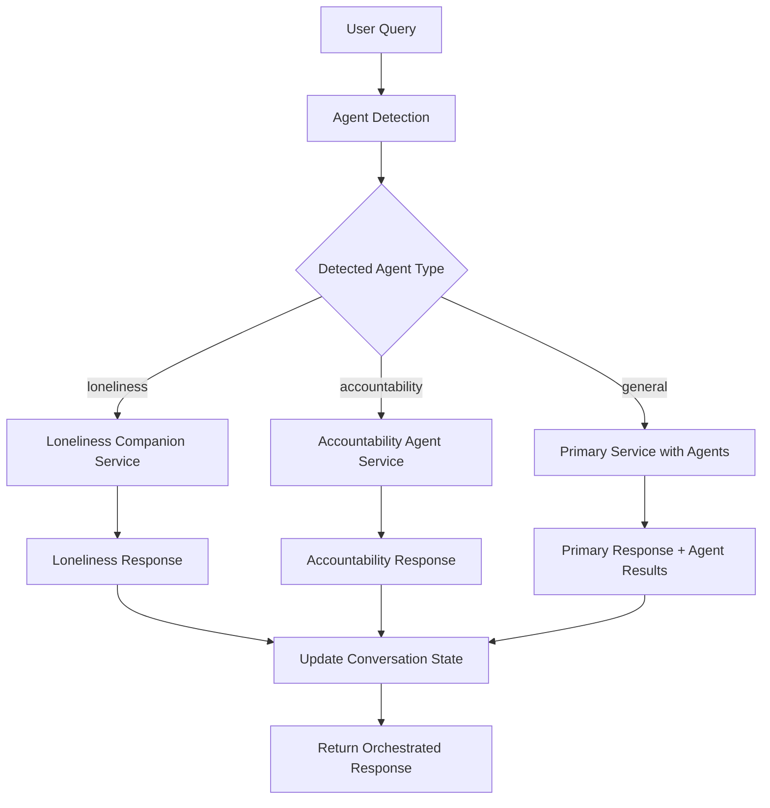

### Background Task Processing

```python
# Background tasks for non-blocking operations
background_tasks.add_task(
    _handle_simple_background_operations,
    state, query, primary_result
)

background_tasks.add_task(
    _generate_next_checkpoint,
    query.conversation_id,
    query.text,
    context,
    task.get('task_id'),
    state,
    query.detected_agent
)
```

## Best Practices

### Service Call Optimization

1. **Connection Reuse**: Use persistent HTTP connections
2. **Timeout Management**: Set appropriate timeouts per service
3. **Retry Logic**: Implement intelligent retry with backoff
4. **Error Handling**: Classify errors for appropriate responses

### State Management Best Practices

1. **Incremental Updates**: Only save changed fields
2. **Async Operations**: Non-blocking state persistence
3. **Cache Layering**: Multi-level cache with intelligent fallback
4. **Dirty Tracking**: Track changes for efficient updates

### Performance Guidelines

1. **Resource Pooling**: Reuse HTTP clients and connections
2. **Caching Strategy**: Cache frequently accessed data
3. **Background Processing**: Offload non-critical operations
4. **Metrics Monitoring**: Track performance continuously

## Troubleshooting

### Common Issues

1. **Service Timeouts**: Check service health and timeout configurations
2. **Memory Leaks**: Monitor cache sizes and cleanup policies
3. **Connection Exhaustion**: Review connection pool settings
4. **State Synchronization**: Verify Redis connectivity and fallback mechanisms

### Debug Commands

```python
# Check service health
await check_service_health("primary")

# Get cache statistics
cache_stats = cache_manager.get_stats()

# Monitor HTTP client status
print(f"Active connections: {http_client._pool._pool_for_request}")
```

## Future Enhancements

### Planned Features

1. **GraphQL Integration**: Alternative query interface
2. **Event Streaming**: Real-time state updates
3. **Service Mesh**: Advanced service discovery and routing
4. **ML-Based Routing**: Intelligent agent selection
5. **Distributed Tracing**: End-to-end request tracking

### Scalability Improvements

1. **Horizontal Scaling**: Multiple orchestrator instances
2. **Load Balancing**: Request distribution strategies
3. **Cache Distribution**: Distributed Redis clusters
4. **Service Partitioning**: Domain-specific orchestrators