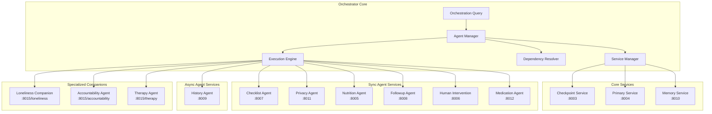
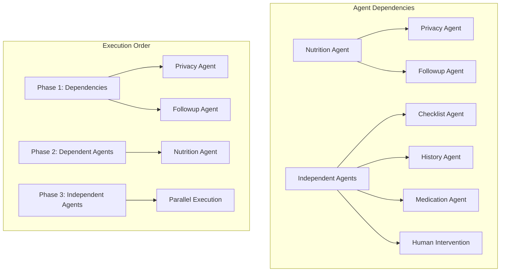
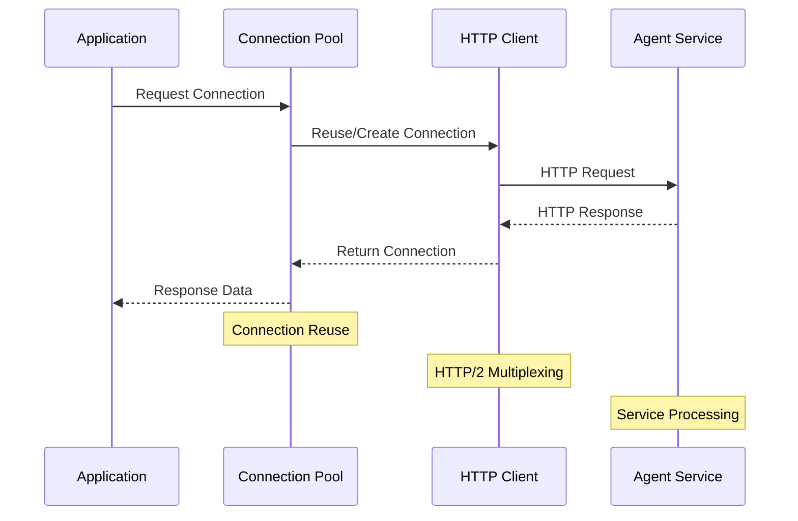
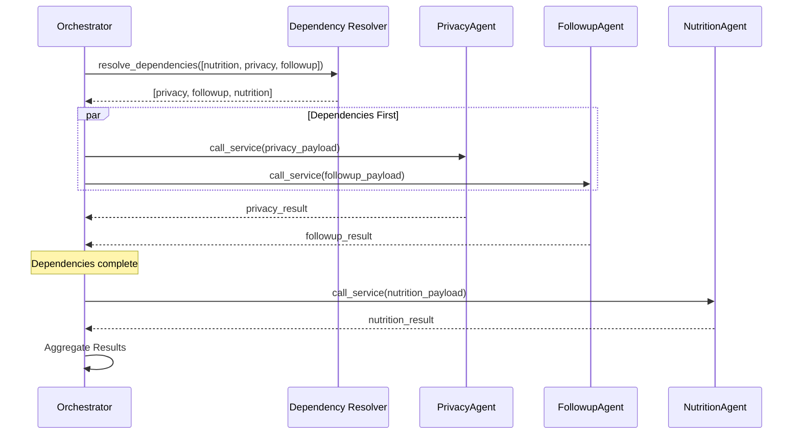
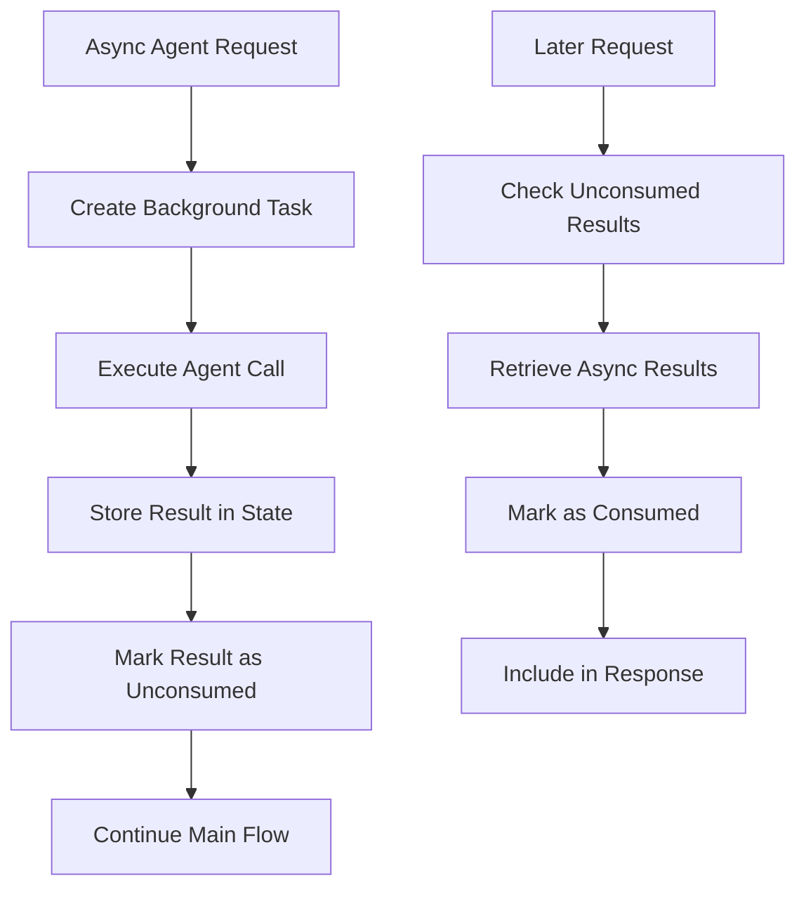
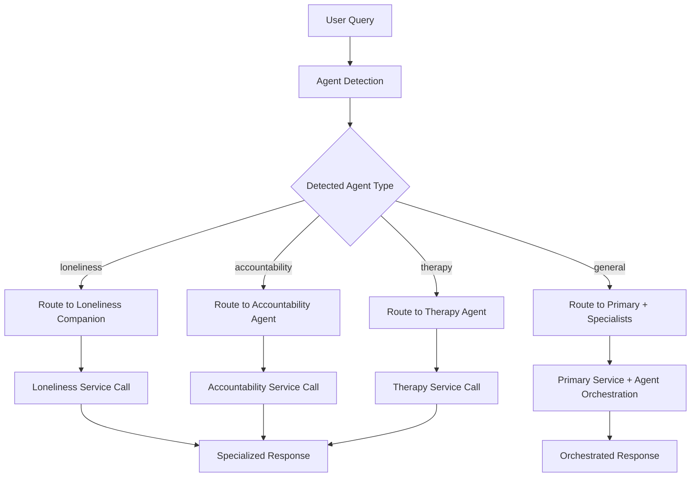
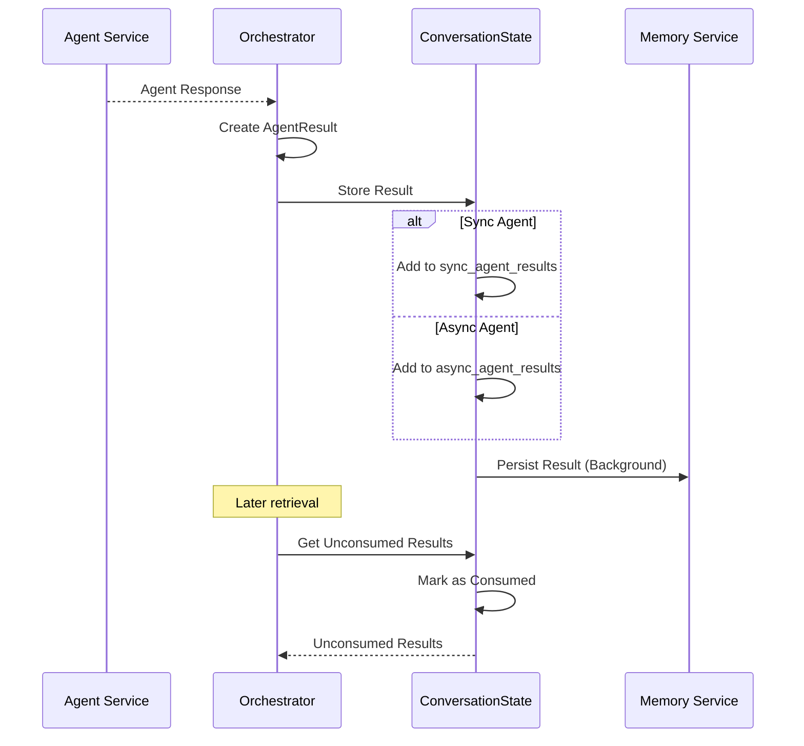

# Services and Agents Orchestration Documentation

## Overview

The Services and Agents Orchestration system is the coordination layer that manages interactions between the orchestrator and various specialized agent services. This system handles service discovery, dependency resolution, parallel execution, error handling, and intelligent routing to deliver comprehensive conversational AI responses.

## Agent Ecosystem Architecture



## Agent Configuration System

### Agent Registry

```python
AGENT_CONFIG = {
    "primary": {
        "port": 8004,
        "path": "/process",
        "type": "core",
        "dependencies": [],
        "timeout": 30.0,
        "retry_count": 3
    },
    "checklist": {
        "port": 8007,
        "path": "/process",
        "type": "sync",
        "dependencies": [],
        "timeout": 15.0,
        "retry_count": 2
    },
    "privacy": {
        "port": 8011,
        "path": "/process",
        "type": "sync",
        "dependencies": [],
        "timeout": 45.0,
        "retry_count": 3
    },
    "nutrition": {
        "port": 8005,
        "path": "/process",
        "type": "sync",
        "dependencies": ["privacy", "followup"],
        "timeout": 30.0,
        "retry_count": 2
    },
    "followup": {
        "port": 8008,
        "path": "/process",
        "type": "sync",
        "dependencies": [],
        "timeout": 20.0,
        "retry_count": 2
    },
    "history": {
        "port": 8009,
        "path": "/process",
        "type": "async",
        "dependencies": [],
        "timeout": 60.0,
        "retry_count": 1
    },
    "human_intervention": {
        "port": 8006,
        "path": "/process",
        "type": "sync",
        "dependencies": [],
        "timeout": 10.0,
        "retry_count": 1
    },
    "medication": {
        "port": 8012,
        "path": "/process",
        "type": "sync",
        "dependencies": [],
        "timeout": 45.0,
        "retry_count": 3
    }
}
```

### Service URL Resolution

```python
@lru_cache(maxsize=32)
def get_service_url(service_name: str) -> str:
    """Get cached service URL to avoid string operations during request handling"""
    config = AGENT_CONFIG.get(service_name)
    if config:
        return f"http://localhost:{config['port']}{config['path']}"
    
    # Fallback to settings for specialized services
    settings = get_settings()
    return getattr(settings, f"{service_name.upper()}_SERVICE_URL", settings.PRIMARY_SERVICE_URL)
```

## Dependency Resolution System

### Dependency Graph



### Dependency Resolution Algorithm

```python
def resolve_dependencies(agents: List[str]) -> List[str]:
    """
    Resolves dependencies for a list of agents and returns a list with dependencies
    at the front of the array.
    """
    resolved = []
    visited = set()

    def resolve_agent_dependencies(agent):
        if agent in visited:
            return
        visited.add(agent)

        # Process dependencies first
        if agent in AGENT_CONFIG:
            for dependency in AGENT_CONFIG[agent]["dependencies"]:
                if dependency in AGENT_CONFIG:
                    resolve_agent_dependencies(dependency)

        # Add the agent if not already in the resolved list
        if agent not in resolved:
            resolved.append(agent)

    # Process each agent
    for agent in agents:
        resolve_agent_dependencies(agent)

    return resolved
```

## Service Communication System

### HTTP Client Management



### Service Call Implementation

```python
async def call_service(
    url: str,
    payload: dict,
    timing: TimingMetrics,
    service_name: str,
    timeout: Optional[httpx.Timeout] = None,
    max_retries: int = 3
) -> dict:
    """
    Enhanced function to call services with advanced error handling, dynamic timeouts, and
    intelligent retry logic.
    """
    ensure_http_client()
    
    # Use service-specific timeout if not provided
    if timeout is None:
        timeout = get_service_timeout(service_name)

    timing.start(f"service_call_{service_name}")
    logger.info(f"Making request to {url} with payload keys: {list(payload.keys())}")

    last_exception = None

    for attempt in range(max_retries + 1):
        try:
            if attempt > 0:
                logger.info(f"Retry attempt {attempt} for {service_name}")
                # Add exponential backoff
                await asyncio.sleep(0.5 * (2 ** (attempt - 1)))

            # Make the request with timeout
            resp = await http_client.post(url, json=payload, timeout=timeout)

            # Handle validation errors (422)
            if resp.status_code == 422:
                error_detail = "Unknown validation error"
                try:
                    error_data = resp.json()
                    if "detail" in error_data:
                        error_detail = str(error_data["detail"])
                except Exception:
                    pass

                logger.error(f"Validation error in request to {url}: {error_detail}")
                raise HTTPException(
                    status_code=422,
                    detail=f"Invalid request to service: {error_detail}"
                )

            # Raise for other HTTP errors
            resp.raise_for_status()
            result = resp.json()
            
            if attempt > 0:
                logger.info(f"Request succeeded on attempt {attempt + 1}")

            return result

        except httpx.HTTPStatusError as e:
            last_exception = e
            status_code = e.response.status_code

            # Don't retry certain status codes
            if status_code in [400, 401, 403, 404, 422]:
                break

        except httpx.TimeoutException as e:
            last_exception = e
            logger.error(f"Timeout error (attempt {attempt + 1}): {url}")

        except httpx.RequestError as e:
            last_exception = e
            logger.error(f"Request error (attempt {attempt + 1}): {url}")

    # Handle final failure after all retries
    timing.end(f"service_call_{service_name}")
    raise HTTPException(status_code=502, detail=f"Service failed after {max_retries + 1} attempts")
```

### Service-Specific Timeout Configuration

```python
SERVICE_TIMEOUTS = {
    "default": httpx.Timeout(
        connect=5.0, read=30.0, write=15.0, pool=10.0
    ),
    "human_intervention": httpx.Timeout(
        connect=3.0, read=10.0, write=10.0, pool=5.0
    ),
    "checklist": httpx.Timeout(
        connect=3.0, read=15.0, write=10.0, pool=5.0
    ),
    "primary_enriched": httpx.Timeout(
        connect=5.0, read=60.0, write=30.0, pool=15.0
    ),
    "medication": httpx.Timeout(
        connect=5.0, read=45.0, write=20.0, pool=10.0
    ),
    "privacy": httpx.Timeout(
        connect=5.0, read=45.0, write=20.0, pool=10.0
    ),
}

def get_service_timeout(service_name: str) -> httpx.Timeout:
    """Get appropriate timeout for a specific service."""
    return SERVICE_TIMEOUTS.get(service_name, SERVICE_TIMEOUTS["default"])
```

## Agent Execution Patterns

### Synchronous Agent Execution



### Asynchronous Agent Execution



### Parallel Specialist Execution

```python
async def call_specialists(
    specialists: List[str],
    text: str,
    conversation_id: str,
    checkpoint: Optional[Checkpoint],
    context: dict,
    timing: TimingMetrics,
    checklist_result: dict = None,
    early_response_callback=None
) -> Dict[str, dict]:
    """
    Optimized parallel specialist calls with priority handling and early response support.
    """
    if not specialists:
        return {}

    timing.start("specialists_calls")
    specialist_responses = {}

    # Initialize with checklist result if already available
    if checklist_result and "checklist" in specialists:
        specialist_responses["checklist"] = checklist_result
        specialists = [s for s in specialists if s != "checklist"]

    if not specialists:
        timing.end("specialists_calls")
        return specialist_responses

    try:
        specialist_responses_new = await asyncio.wait_for(
            _call_specialists_parallel(
                specialists, text, conversation_id, checkpoint, context, timing, early_response_callback
            ),
            timeout=120.0  # Total timeout with cap
        )
        specialist_responses.update(specialist_responses_new)

    except asyncio.TimeoutError:
        logger.error("Specialists call timed out")
        # Add timeout errors for missing specialists
        for spec in specialists:
            if spec not in specialist_responses:
                specialist_responses[spec] = {
                    "error": f"Specialist timed out",
                    "status": "timeout"
                }

    timing.end("specialists_calls")
    return specialist_responses
```

## Specialized Agent Routing

### Agent Detection and Routing



### Loneliness Companion Integration

```python
if query.detected_agent == "loneliness":
    loneliness_payload = {
        "user_query": query.text,
        "context": str(context),
        "checkpoint": str(current_checkpoint) if current_checkpoint else "",
        "conversation_id": query.conversation_id,
        "user_profile_id": query.user_profile_id,
        "agent_instance_id": query.agent_instance_id,
        "user_id": query.user_profile_id
    }

    primary_result = await call_service(
        settings.LONELINESS_SERVICE_URL,
        loneliness_payload,
        timing,
        "loneliness",
        timeout=PRIMARY_TIMEOUT
    )
```

### Accountability Agent Integration

```python
elif query.detected_agent == "accountability":
    # Convert checkpoint object to string format
    checkpoint_str = None
    if current_checkpoint:
        if isinstance(current_checkpoint, dict):
            checkpoint_str = current_checkpoint.get('name') or current_checkpoint.get('id', '')
        else:
            checkpoint_str = str(current_checkpoint)
    
    # Convert context to string format expected by accountability agent
    context_str = ""
    if context:
        if isinstance(context, list) and context:
            context_item = context[0] if context else {}
            if isinstance(context_item, dict):
                context_str = str(context_item.get('day', 'monday'))
            else:
                context_str = str(context_item)

    accountability_payload = {
        "user_query": query.text,
        "conversation_id": query.conversation_id,
        "checkpoint": checkpoint_str or "",
        "context": context_str,
        "user_id": query.individual_id,
        "user_profile_id": query.user_profile_id,
        "agent_instance_id": query.agent_instance_id
    }

    primary_result = await call_service(
        settings.ACCOUNTABILITY_SERVICE_URL,
        accountability_payload,
        timing,
        "accountability_companion",
        timeout=PRIMARY_TIMEOUT
    )
```

## Checklist and Task Management

### Checklist Configuration

```python
CHECKLISTS = {
    "followup": {
        "task_id": "followup",
        "label": "followup",
        "source": "SupportAgent",
        "checklist": [
            {
                "name": "Please confirm your full name.",
                "status": "pending",
                "expected_inputs": ["full_name"],
                "collected_inputs": []
            },
            {
                "name": "Please provide your date of birth.",
                "status": "pending",
                "expected_inputs": ["date_of_birth"],
                "collected_inputs": []
            },
            {
                "name": "Please share your contact number.",
                "status": "pending",
                "expected_inputs": ["phone_number"],
                "collected_inputs": []
            }
        ],
        "current_checkpoint_index": 0,
        "is_active": True
    },
    "privacy": {
        "task_id": "privacy",
        "label": "privacy",
        "source": "SupportAgent",
        "checklist": [
            {
                "name": "provide me your full name",
                "status": "pending",
                "expected_inputs": ["name and surname"],
                "collected_inputs": []
            },
            {
                "name": "please let me know your date of birth",
                "status": "pending",
                "expected_inputs": ["date", "date of birth", "dob", "dd/mm/yyyy"],
                "collected_inputs": []
            },
            {
                "name": "please provide your contact number",
                "status": "pending",
                "expected_inputs": ["contact number", "phone number"],
                "collected_inputs": []
            }
        ],
        "current_checkpoint_index": 0,
        "is_active": True
    }
}
```

### Checklist Service Integration

```python
async def call_checklist_service(
    conversation_id: str,
    text: str,
    checkpoint: Optional[Checkpoint],
    context: dict,
    evaluation_only: bool,
    timing: TimingMetrics
) -> dict:
    """
    Dedicated function for checklist calls with caching for evaluation calls.
    """
    # Try to get from cache first for evaluation calls
    if evaluation_only:
        cached_result = await get_cached_checkpoint_evaluation(
            conversation_id,
            checkpoint,
            hash(text)
        )
        if cached_result:
            logger.info(f"Cache hit for checkpoint evaluation: {checkpoint}")
            return cached_result

    # Call the service if not in cache
    checklist_url = get_service_url("checklist")
    result = await call_service(
        checklist_url,
        {
            "text": text,
            "conversation_id": conversation_id,
            "checkpoint": checkpoint,
            "context": context,
            "evaluation_only": evaluation_only,
        },
        timing,
        "checklist"
    )

    # Cache evaluation results
    if evaluation_only:
        await cache_checkpoint_evaluation(
            conversation_id,
            checkpoint,
            hash(text),
            result
        )

    return result
```

## Agent Result Management

### Agent Result Schema

```python
class AgentResult(BaseModel):
    agent_name: str
    status: AgentResponseStatus  # success, error, partial
    result_payload: Dict[str, Any]
    message_to_user: Optional[str] = None
    action_required: bool = False
    timestamp: datetime = Field(default_factory=datetime.now)
    consumed: bool = False

def create_agent_result(
    agent_name: str,
    status: AgentResponseStatus,
    result_payload: Dict[str, Any],
    message_to_user: Optional[str] = None,
    action_required: bool = False
) -> AgentResult:
    """Create a standardized agent result object"""
    return AgentResult(
        agent_name=agent_name,
        status=status,
        result_payload=result_payload,
        message_to_user=message_to_user,
        action_required=action_required,
        consumed=False
    )
```

### Result Processing Flow



## Performance Optimization Strategies

### Connection Pool Management

```python
# Optimized HTTP client initialization
limits = httpx.Limits(
    max_keepalive_connections=50,
    max_connections=200,
    keepalive_expiry=30.0
)

http_client = httpx.AsyncClient(
    timeout=HTTP_TIMEOUT,
    limits=limits,
    http2=True,  # Enable HTTP/2 for connection multiplexing
    transport=httpx.AsyncHTTPTransport(
        http2=True,
        retries=2
    )
)
```

### Early Response Optimization

```python
async def early_response_callback(partial_responses: Dict[str, dict]):
    """Handle early responses from critical agents"""
    if "checklist" in partial_responses:
        # Immediately process checklist results
        checklist_result = partial_responses["checklist"]
        if checklist_result.get("checkpoint_complete"):
            # Trigger checkpoint advancement
            await advance_checkpoint_immediately(checklist_result)
```

### Batch Processing

```python
async def batch_agent_calls(agent_requests: List[Dict]) -> Dict[str, Any]:
    """Execute multiple agent calls in optimized batches"""
    batch_size = 5  # Optimal batch size
    results = {}
    
    for i in range(0, len(agent_requests), batch_size):
        batch = agent_requests[i:i+batch_size]
        batch_tasks = []
        
        for request in batch:
            task = asyncio.create_task(
                call_service(
                    request["url"],
                    request["payload"],
                    request["timing"],
                    request["service_name"]
                )
            )
            batch_tasks.append((request["agent_name"], task))
        
        # Wait for batch completion
        for agent_name, task in batch_tasks:
            try:
                result = await task
                results[agent_name] = result
            except Exception as e:
                results[agent_name] = {"error": str(e), "status": "error"}
    
    return results
```

## Error Handling and Circuit Breaker

### Service Health Monitoring

```python
async def check_service_health(service_name: str) -> bool:
    """Check if a service is healthy and responding."""
    try:
        url = get_service_url(service_name)
        health_url = url.replace("/process", "/health")
        
        ensure_http_client()
        response = await http_client.get(health_url, timeout=5.0)
        return response.status_code == 200
    except Exception as e:
        logger.warning(f"Health check failed for {service_name}: {e}")
        return False
```

### Circuit Breaker Implementation

```python
class ServiceCircuitBreaker:
    def __init__(self, service_name: str, failure_threshold: int = 5, recovery_timeout: int = 60):
        self.service_name = service_name
        self.failure_threshold = failure_threshold
        self.recovery_timeout = recovery_timeout
        self.failure_count = 0
        self.last_failure_time = None
        self.state = "closed"  # closed, open, half-open

    async def call_service(self, service_call):
        if self.state == "open":
            if time.time() - self.last_failure_time > self.recovery_timeout:
                self.state = "half-open"
            else:
                raise CircuitBreakerOpenError(f"Circuit breaker open for {self.service_name}")

        try:
            result = await service_call()
            
            if self.state == "half-open":
                self.state = "closed"
                self.failure_count = 0
            
            return result
            
        except Exception as e:
            self.failure_count += 1
            self.last_failure_time = time.time()
            
            if self.failure_count >= self.failure_threshold:
                self.state = "open"
            
            raise e
```

## Agent Development Guidelines

### Standard Agent Interface

```python
# Standard agent request format
class AgentRequest(BaseModel):
    text: str
    conversation_id: str
    checkpoint: Optional[str] = None
    context: Dict[str, Any] = {}
    user_profile_id: Optional[str] = None
    agent_instance_id: Optional[str] = None

# Standard agent response format
class AgentResponse(BaseModel):
    status: Literal["success", "error", "partial"]
    response: str
    result_payload: Dict[str, Any] = {}
    message_to_user: Optional[str] = None
    action_required: bool = False
    checkpoint_complete: bool = False
    requires_human: bool = False
```

### Agent Implementation Template

```python
from fastapi import FastAPI, HTTPException
from pydantic import BaseModel
import logging

app = FastAPI(title="Example Agent Service")
logger = logging.getLogger(__name__)

@app.post("/process")
async def process_request(request: AgentRequest) -> AgentResponse:
    """Main processing endpoint for the agent"""
    try:
        logger.info(f"Processing request for conversation {request.conversation_id}")
        
        # Agent-specific processing logic
        result = await process_agent_logic(request)
        
        return AgentResponse(
            status="success",
            response=result["response"],
            result_payload=result.get("payload", {}),
            checkpoint_complete=result.get("checkpoint_complete", False)
        )
        
    except Exception as e:
        logger.error(f"Agent processing error: {e}")
        return AgentResponse(
            status="error",
            response=f"Agent processing failed: {str(e)}",
            result_payload={"error": str(e)}
        )

@app.get("/health")
async def health_check():
    """Health check endpoint"""
    return {"status": "healthy", "service": "example_agent"}

async def process_agent_logic(request: AgentRequest) -> Dict[str, Any]:
    """Implement agent-specific logic here"""
    pass
```

## Monitoring and Observability

### Service Metrics Collection

```python
class ServiceMetrics:
    def __init__(self):
        self.call_counts = defaultdict(int)
        self.response_times = defaultdict(list)
        self.error_counts = defaultdict(int)
        self.success_rates = defaultdict(float)

    def record_call(self, service_name: str, response_time: float, success: bool):
        self.call_counts[service_name] += 1
        self.response_times[service_name].append(response_time)
        
        if not success:
            self.error_counts[service_name] += 1
        
        # Calculate success rate
        total_calls = self.call_counts[service_name]
        errors = self.error_counts[service_name]
        self.success_rates[service_name] = ((total_calls - errors) / total_calls) * 100

    def get_metrics(self) -> Dict[str, Any]:
        return {
            "service_health": {
                service: {
                    "total_calls": self.call_counts[service],
                    "avg_response_time": sum(times) / len(times) if times else 0,
                    "error_count": self.error_counts[service],
                    "success_rate": self.success_rates[service]
                }
                for service, times in self.response_times.items()
            }
        }

# Global metrics instance
service_metrics = ServiceMetrics()
```

### Performance Dashboard

```python
def get_orchestrator_dashboard() -> Dict[str, Any]:
    """Get comprehensive orchestrator performance dashboard"""
    return {
        "service_metrics": service_metrics.get_metrics(),
        "cache_performance": cache_manager.get_stats(),
        "agent_statistics": {
            "total_agents": len(AGENT_CONFIG),
            "active_agents": [name for name, config in AGENT_CONFIG.items() if config["type"] != "deprecated"],
            "dependency_chains": get_dependency_chains()
        },
        "system_health": {
            "http_client_status": "healthy" if http_client else "not_initialized",
            "redis_status": "available" if cache_manager.redis_available else "unavailable",
            "memory_usage": get_memory_usage()
        }
    }
```

## Best Practices

### Agent Design Principles

1. **Stateless Operations**: Agents should be stateless and idempotent
2. **Standard Interfaces**: Follow consistent request/response patterns
3. **Error Handling**: Implement comprehensive error handling and logging
4. **Health Checks**: Provide health check endpoints for monitoring
5. **Timeout Handling**: Implement appropriate timeout configurations

### Service Communication Best Practices

1. **Connection Reuse**: Leverage HTTP connection pooling
2. **Retry Logic**: Implement intelligent retry strategies
3. **Circuit Breakers**: Use circuit breakers for fault tolerance
4. **Monitoring**: Track service performance and health metrics
5. **Documentation**: Maintain clear API documentation

### Performance Optimization

1. **Parallel Execution**: Execute independent agents in parallel
2. **Dependency Resolution**: Optimize dependency execution order
3. **Caching**: Cache frequently used results and configurations
4. **Resource Management**: Properly manage HTTP clients and connections
5. **Background Processing**: Use background tasks for non-critical operations

## Troubleshooting Guide

### Common Issues

1. **Agent Timeouts**
   - Check service health endpoints
   - Verify timeout configurations
   - Monitor network connectivity

2. **Dependency Resolution Failures**
   - Verify agent configuration
   - Check dependency service availability
   - Review execution order

3. **Memory Leaks**
   - Monitor connection pool usage
   - Check for unclosed HTTP clients
   - Review agent result storage

4. **Performance Degradation**
   - Monitor service response times
   - Check cache hit rates
   - Verify parallel execution

### Debug Commands

```bash
# Check agent service health
curl http://localhost:8007/health
curl http://localhost:8011/health

# Test agent endpoint
curl -X POST http://localhost:8007/process \
  -H "Content-Type: application/json" \
  -d '{"text":"test","conversation_id":"debug","checkpoint":"test"}'

# Monitor orchestrator metrics
curl http://localhost:8002/metrics

# Check Redis connectivity
redis-cli ping
```

### Monitoring Scripts

```python
# Agent health check script
async def check_all_agents():
    for agent_name in AGENT_CONFIG.keys():
        health = await check_service_health(agent_name)
        print(f"{agent_name}: {'✓' if health else '✗'}")

# Performance monitoring
async def monitor_performance():
    metrics = service_metrics.get_metrics()
    for service, data in metrics["service_health"].items():
        print(f"{service}: {data['success_rate']:.1f}% success, {data['avg_response_time']:.0f}ms avg")
```