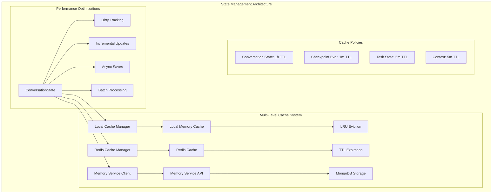
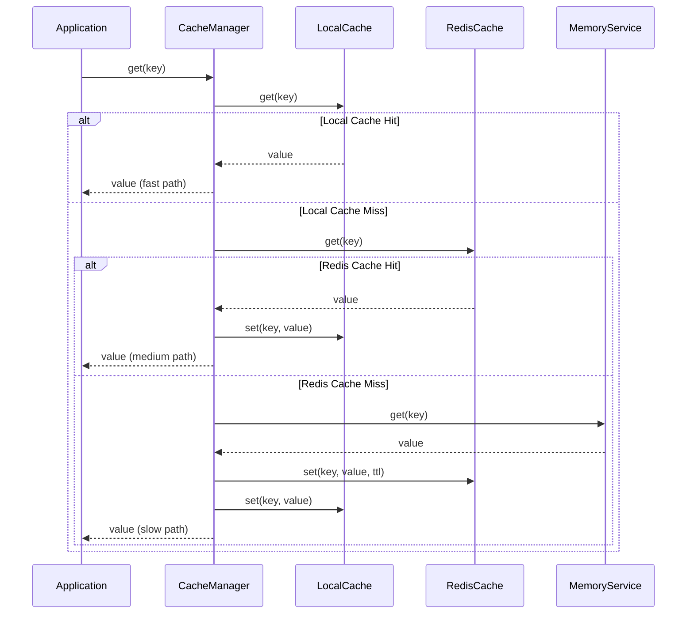
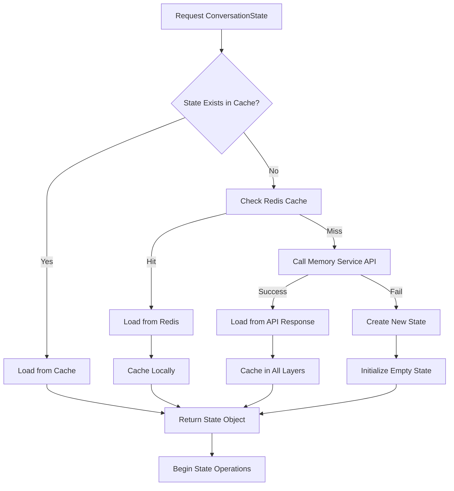
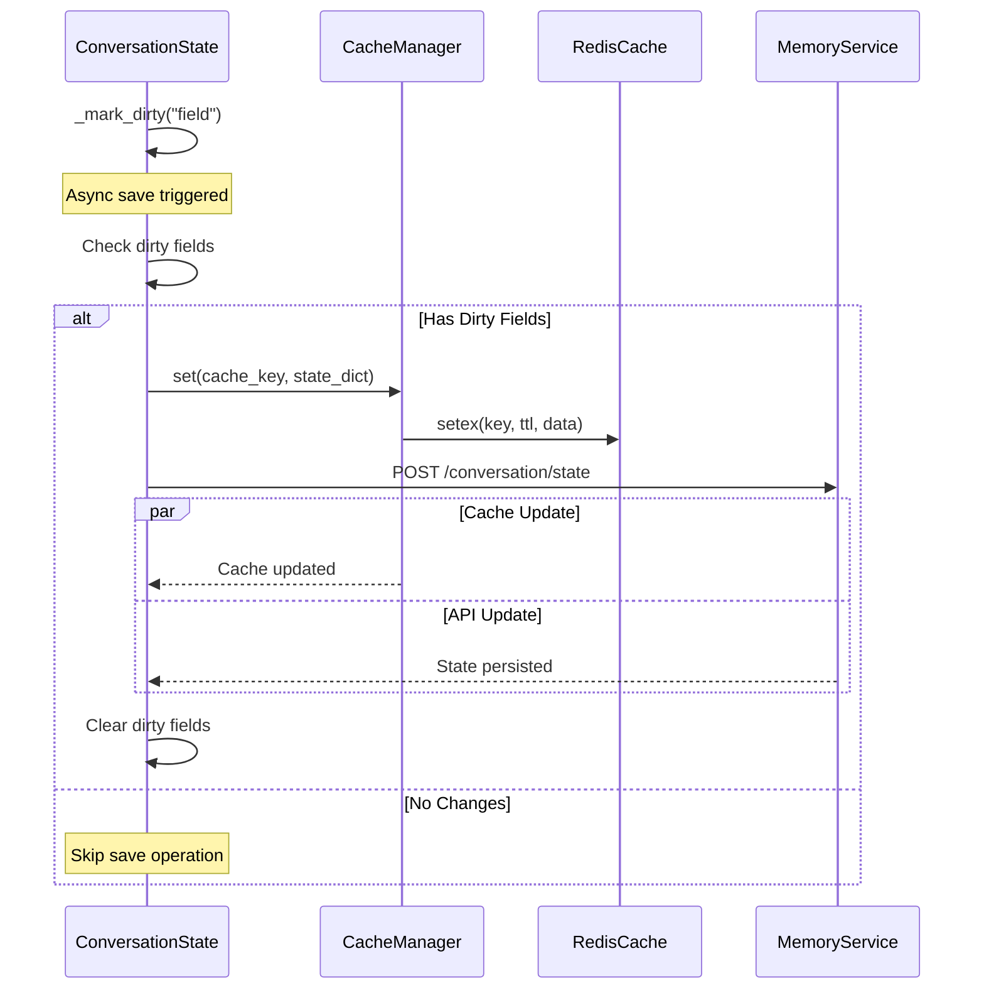
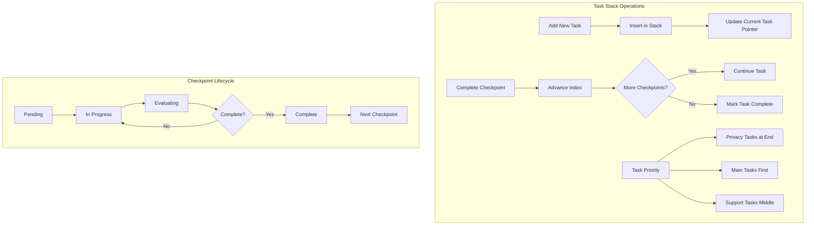
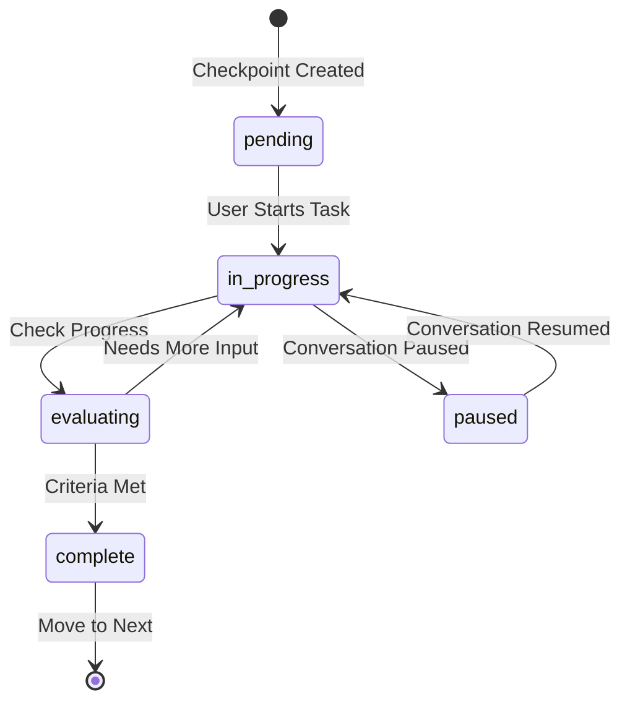
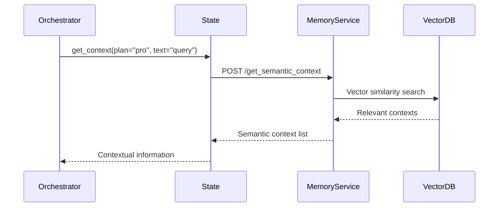
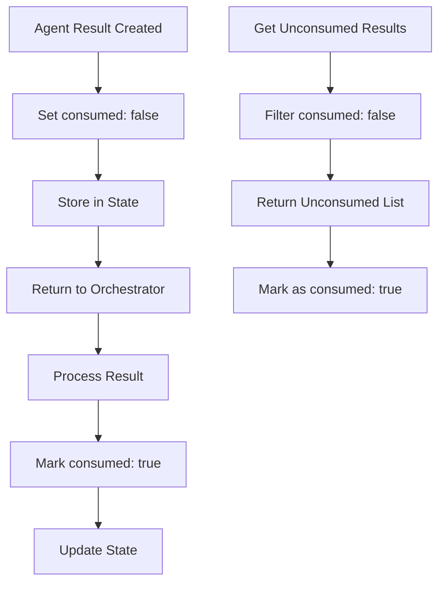
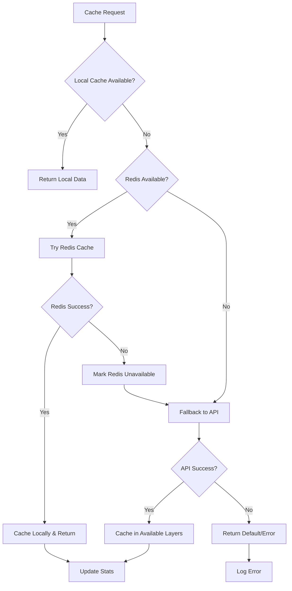

# State Management and Caching System Documentation

## Overview

The State Management and Caching System is the backbone of the Polaris orchestrator, providing ultra-optimized conversation state persistence, multi-level caching, and intelligent data synchronization. Built for high-performance async operations, this system ensures fast access to conversation data while maintaining consistency across multiple storage layers.

## Architecture Overview



## Core Components

### 1. ConversationState Class

The main state management class that handles all conversation data and operations.

```python
class ConversationState:
    def __init__(self, conversation_id: str, individual_id: Optional[str] = None):
        self.conversation_id = conversation_id
        self.individual_id = individual_id
        
        # Core conversation data
        self.task_stack: List[Task] = []
        self.checkpoint_progress: Dict[str, bool] = {}
        self.context: List[Dict[str, str]] = []
        
        # Agent results storage
        self.async_agent_results: Dict[str, AgentResult] = {}
        self.sync_agent_results: Dict[str, List[AgentResult]] = defaultdict(list)
        
        # Performance optimizations
        self._dirty_fields: Set[str] = set()
        self._last_save_time: Optional[datetime] = None
```

### 2. Multi-Level Caching System

#### Cache Manager Architecture



#### Cache Performance Statistics

```python
@dataclass
class CacheStats:
    redis_hits: int = 0
    redis_misses: int = 0
    local_hits: int = 0
    local_misses: int = 0
    api_calls: int = 0
    cache_writes: int = 0
    
    def hit_rate(self) -> float:
        total_requests = (self.redis_hits + self.redis_misses + 
                         self.local_hits + self.local_misses)
        if total_requests == 0:
            return 0.0
        total_hits = self.redis_hits + self.local_hits
        return (total_hits / total_requests) * 100
```

### 3. Local Memory Cache

Thread-safe LRU cache for ultra-fast access to frequently used data.

```python
class LocalCache:
    def __init__(self, max_size: int = 1000):
        self.cache = OrderedDict()
        self.max_size = max_size
        self.lock = threading.RLock()
        self.stats = CacheStats()

    def get(self, key: str) -> Optional[Any]:
        with self.lock:
            if key in self.cache:
                # Move to end (most recently used)
                value = self.cache.pop(key)
                self.cache[key] = value
                self.stats.local_hits += 1
                return value
            self.stats.local_misses += 1
            return None

    def set(self, key: str, value: Any) -> None:
        with self.lock:
            if key in self.cache:
                self.cache.pop(key)
            elif len(self.cache) >= self.max_size:
                # Remove least recently used
                self.cache.popitem(last=False)
            self.cache[key] = value
```

### 4. Redis Cache Layer

Distributed caching with connection pooling and automatic failover.

```python
class CacheManager:
    async def initialize(self):
        try:
            self.connection_pool = redis.ConnectionPool.from_url(
                REDIS_URL,
                max_connections=20,
                retry_on_timeout=True,
                socket_connect_timeout=2,
                socket_timeout=2
            )
            self.redis_client = redis.Redis(connection_pool=self.connection_pool)
            await self.redis_client.ping()
            self.redis_available = True
        except Exception as e:
            logger.warning(f"Redis unavailable, using local cache only: {e}")
            self.redis_available = False
```

## State Lifecycle Management

### State Creation and Loading



### Dirty Field Tracking

The system tracks which fields have changed to enable incremental updates:

```python
def _mark_dirty(self, field: str):
    """Mark field as dirty for incremental saves"""
    self._dirty_fields.add(field)

# Usage in state modifications
def set_Tasks(self, checkpoints, task, checkpoint_types=None):
    # ... process tasks ...
    self.task_stack = [main_task]
    self._mark_dirty("task_stack")  # Track change
```

### Incremental Save Operations



## Task Stack Management

### Task Structure

```python
class Task:
    task_id: str
    label: str
    source: CheckpointType  # Main, SupportAgent, Interrupt
    checklist: List[Checkpoint]
    current_checkpoint_index: int
    is_active: bool
    created_at: datetime
    updated_at: datetime
```

### Task Stack Operations



### Checkpoint State Transitions



## Context Management

### Context Storage Strategies

```python
class ConversationState:
    def __init__(self):
        # Different context types for different use cases
        self.context: List[Dict[str, str]] = []           # Short-term working context
        self.complete_context: List[Dict[str, str]] = []   # Full conversation history
        self.temporary_context: List[Dict[str, str]] = []  # Session-specific context
```

### Semantic Context Retrieval



### Context Update Flow

```python
async def update_context(self, query: str, response: str, plan: str):
    """Optimized context update with batch processing"""
    new_messages = [
        {"role": "user", "content": query},
        {"role": "assistant", "content": response}
    ]
    
    self.context.extend(new_messages)
    self.complete_context.extend(new_messages)
    self._mark_dirty("context")
    
    # Async save without blocking
    asyncio.create_task(self._save_context_async(plan))
```

## Agent Results Management

### Agent Result Storage

```python
# Async agent results (long-running agents)
async def set_async_agent_result(self, agent_name: str, result: AgentResult):
    agent_result = {
        "agent_name": agent_name,
        "status": result.get("status", "success"),
        "result_payload": result,
        "message_to_user": result.get("message_to_user"),
        "action_required": result.get("action_required", False),
        "timestamp": datetime.now().isoformat(),
        "consumed": False
    }
    
    self.async_agent_results[agent_name] = agent_result
    self._mark_dirty("async_agent_results")

# Sync agent results (immediate responses)
async def set_sync_agent_result(self, agent_name: str, result: AgentResult):
    self.sync_agent_results[agent_name].append(result)
    self._mark_dirty("sync_agent_results")
```

### Result Consumption Tracking



## Caching Strategies

### Cache Key Generation

```python
def cache_key(prefix: str, *args) -> str:
    """Generate consistent cache keys"""
    key_parts = [str(arg) for arg in args if arg is not None]
    key_string = f"{prefix}:{':'.join(key_parts)}"
    return hashlib.md5(key_string.encode()).hexdigest()[:16]
```

### Cache Decorator

```python
def cached(ttl: int = CACHE_TTL, prefix: str = "default"):
    """Decorator for caching method results"""
    def decorator(func):
        @wraps(func)
        async def wrapper(self, *args, **kwargs):
            # Generate cache key
            key_args = [getattr(self, 'conversation_id', ''), str(args), str(sorted(kwargs.items()))]
            key = cache_key(f"{prefix}:{func.__name__}", *key_args)
            
            # Try cache first
            cached_result = await cache_manager.get(key)
            if cached_result is not None:
                return cached_result
            
            # Execute function and cache result
            result = await func(self, *args, **kwargs)
            if result is not None:
                await cache_manager.set(key, result, ttl)
            
            return result
        return wrapper
    return decorator
```

### Cache Performance Monitoring

```python
def get_cache_stats() -> Dict[str, Any]:
    """Get comprehensive cache performance statistics"""
    return {
        "redis_available": cache_manager.redis_available,
        "cache_performance": {
            "redis_hits": cache_manager.stats.redis_hits,
            "redis_misses": cache_manager.stats.redis_misses,
            "local_hits": cache_manager.stats.local_hits,
            "local_misses": cache_manager.stats.local_misses,
            "hit_rate": cache_manager.stats.hit_rate(),
        },
        "operation_stats": {
            "api_calls": cache_manager.stats.api_calls,
            "cache_writes": cache_manager.stats.cache_writes,
        },
        "local_cache": {
            "size": len(cache_manager.local_cache.cache),
            "max_size": cache_manager.local_cache.max_size,
            "utilization": len(cache_manager.local_cache.cache) / cache_manager.local_cache.max_size * 100
        }
    }
```

## Performance Optimizations

### Batch Operations

```python
async def batch_get(self, keys: List[str]) -> Dict[str, Any]:
    """Batch get operation for better performance"""
    results = {}
    missing_keys = []
    
    # Check local cache first
    for key in keys:
        local_value = self.local_cache.get(key)
        if local_value is not None:
            results[key] = local_value
        else:
            missing_keys.append(key)
    
    # Batch get from Redis for missing keys
    if missing_keys and self.redis_available:
        try:
            redis_values = await self.redis_client.mget(missing_keys)
            for key, redis_value in zip(missing_keys, redis_values):
                if redis_value:
                    value = pickle.loads(redis_value)
                    results[key] = value
                    self.local_cache.set(key, value)
        except Exception as e:
            logger.warning(f"Redis batch get error: {e}")
    
    return results
```

### Memory Optimization

```python
class ConversationState:
    def __init__(self):
        # Pre-allocate data structures for better memory efficiency
        self.task_stack: List[Task] = []
        self.checkpoint_progress: Dict[str, bool] = {}
        
        # Use defaultdict for sparse data
        self.sync_agent_results: Dict[str, List[AgentResult]] = defaultdict(list)
        
        # Performance tracking
        self._dirty_fields: Set[str] = set()
        self._last_save_time: Optional[datetime] = None
```

### Async Context Management

```python
class ConversationState:
    async def __aenter__(self):
        """Async context manager entry"""
        await self._ensure_http_client()
        return self

    async def __aexit__(self, exc_type, exc_val, exc_tb):
        """Async context manager exit"""
        if self._http_client:
            await self._http_client.aclose()

# Usage
async with ConversationState.get_or_create(conversation_id) as state:
    # Operations with automatic cleanup
    await state.update_context(query, response, plan)
```

## Error Handling and Recovery

### Cache Fallback Strategy



### Resilience Patterns

```python
async def resilient_save(self, max_retries: int = 3):
    """Save with retry logic and fallback strategies"""
    for attempt in range(max_retries):
        try:
            # Try primary save path
            await self._save_to_api()
            break
        except httpx.TimeoutException:
            if attempt < max_retries - 1:
                await asyncio.sleep(2 ** attempt)  # Exponential backoff
                continue
            # Final attempt failed - cache locally for later retry
            await self._queue_for_retry()
        except httpx.HTTPStatusError as e:
            if e.response.status_code == 422:
                # Validation error - try to fix and retry
                await self._fix_validation_errors()
                continue
            raise
```

## Configuration and Tuning

### Cache Configuration

```python
# Cache TTL settings
CACHE_POLICIES = {
    "conversation_state": 3600,      # 1 hour
    "checkpoint_evaluation": 60,      # 1 minute
    "task_state": 300,               # 5 minutes
    "context": 300,                  # 5 minutes
    "agent_results": 1800,           # 30 minutes
}

# Local cache settings
LOCAL_CACHE_CONFIG = {
    "max_size": 1000,                # Maximum items in memory
    "cleanup_interval": 300,         # Cleanup every 5 minutes
    "max_memory": 100 * 1024 * 1024, # 100MB maximum memory usage
}

# Redis connection settings
REDIS_CONFIG = {
    "max_connections": 20,
    "retry_on_timeout": True,
    "socket_connect_timeout": 2,
    "socket_timeout": 2,
    "health_check_interval": 30
}
```

### Performance Tuning

```python
# Memory optimization settings
MEMORY_OPTIMIZATION = {
    "context_window": 16,            # Keep last 16 context messages
    "max_task_stack_size": 10,       # Maximum concurrent tasks
    "checkpoint_history_limit": 50,   # Keep last 50 checkpoints
    "agent_result_retention": 100    # Keep last 100 agent results
}

# Async operation settings
ASYNC_CONFIG = {
    "save_batch_size": 10,           # Batch multiple saves
    "save_interval": 5,              # Save every 5 seconds minimum
    "background_task_timeout": 30,   # Background task timeout
    "concurrent_saves": 3            # Maximum concurrent save operations
}
```

## Monitoring and Debugging

### State Inspection Tools

```python
def inspect_state(conversation_id: str) -> Dict[str, Any]:
    """Comprehensive state inspection for debugging"""
    state = await ConversationState.get_or_create(conversation_id)
    
    return {
        "conversation_info": {
            "id": state.conversation_id,
            "individual_id": state.individual_id,
            "is_new": state.is_new_conversation(),
            "last_save": state._last_save_time
        },
        "task_stack": {
            "total_tasks": len(state.task_stack),
            "active_tasks": [t for t in state.task_stack if t.get("is_active")],
            "current_task": state.current_task
        },
        "context_info": {
            "context_size": len(state.context),
            "complete_context_size": len(state.complete_context),
            "temporary_context_size": len(state.temporary_context)
        },
        "agent_results": {
            "async_results": len(state.async_agent_results),
            "sync_results": sum(len(results) for results in state.sync_agent_results.values())
        },
        "performance": {
            "dirty_fields": list(state._dirty_fields),
            "cache_stats": get_cache_stats()
        }
    }
```

### Performance Metrics

```python
def get_performance_metrics() -> Dict[str, Any]:
    """Get detailed performance metrics"""
    return {
        "cache_performance": get_cache_stats(),
        "memory_usage": {
            "local_cache_size": len(cache_manager.local_cache.cache),
            "local_cache_memory": sys.getsizeof(cache_manager.local_cache.cache),
            "redis_connections": cache_manager.connection_pool.connection_kwargs if cache_manager.connection_pool else None
        },
        "operation_timings": {
            "avg_save_time": calculate_avg_save_time(),
            "avg_load_time": calculate_avg_load_time(),
            "cache_hit_latency": calculate_cache_latency()
        }
    }
```

## Best Practices

### State Management Guidelines

1. **Minimize State Size**: Keep only necessary data in memory
2. **Use Dirty Tracking**: Only save changed fields
3. **Implement Caching**: Use multi-level caching for performance
4. **Async Operations**: Don't block on saves and updates
5. **Error Recovery**: Implement fallback strategies

### Caching Best Practices

1. **Appropriate TTLs**: Set cache expiration based on data volatility
2. **Cache Warming**: Pre-populate frequently accessed data
3. **Memory Management**: Monitor and limit cache memory usage
4. **Invalidation Strategy**: Clear outdated cache entries promptly
5. **Performance Monitoring**: Track hit rates and latencies

### Performance Optimization

1. **Batch Operations**: Group multiple operations together
2. **Connection Pooling**: Reuse database and cache connections
3. **Lazy Loading**: Load data only when needed
4. **Background Processing**: Offload non-critical operations
5. **Resource Cleanup**: Properly close connections and clear caches

## Troubleshooting Guide

### Common Issues

1. **High Memory Usage**
   - Check local cache size and cleanup policies
   - Monitor for memory leaks in state objects
   - Verify context pruning is working

2. **Slow State Operations**
   - Check cache hit rates
   - Verify Redis connectivity
   - Monitor API response times

3. **Data Inconsistency**
   - Verify dirty field tracking
   - Check async save completion
   - Validate cache invalidation

4. **Cache Performance Issues**
   - Monitor Redis connection health
   - Check cache key distribution
   - Verify TTL settings are appropriate

### Debug Commands

```python
# Check cache performance
cache_stats = cache_manager.get_stats()
print(f"Cache hit rate: {cache_stats['hit_rate']:.2f}%")

# Inspect conversation state
state_info = await inspect_state("conversation_123")
print(json.dumps(state_info, indent=2))

# Monitor Redis connectivity
if cache_manager.redis_available:
    await cache_manager.redis_client.ping()
    print("Redis connection healthy")
else:
    print("Redis unavailable - using local cache only")

# Check memory usage
import psutil
process = psutil.Process()
print(f"Memory usage: {process.memory_info().rss / 1024 / 1024:.2f} MB")
```