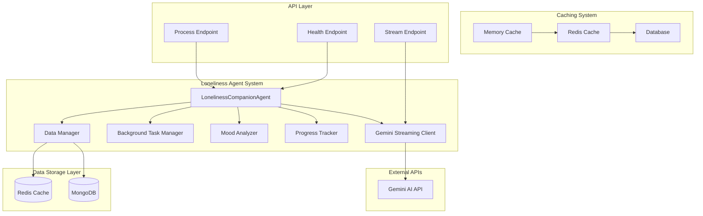
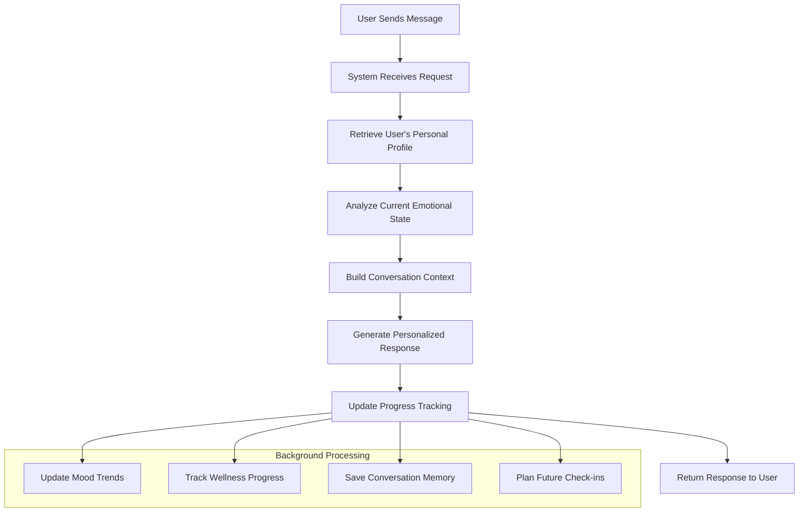

# Loneliness Companion Agent Documentation

## Overview

The Loneliness Companion Agent is a sophisticated emotional support service designed to provide empathetic companionship and passive social therapy. This agent specializes in understanding and responding to feelings of loneliness, social isolation, and emotional disconnection through personalized, compassionate interactions.

### What Makes It Special

The agent goes beyond simple chatbot responses by maintaining deep understanding of each user's personality, relationships, interests, and emotional patterns. It creates a sense of genuine companionship by remembering past conversations, tracking emotional progress, and adapting its communication style to each individual's needs.

### Core Mission

- **Emotional Validation**: Acknowledging and validating users' feelings without judgment
- **Personalized Support**: Tailoring responses based on individual personality and history
- **Progress Tracking**: Monitoring emotional wellness and social engagement over time
- **Consistent Companionship**: Providing reliable, always-available emotional support

## System Architecture



## Core Components

### 1. LonelinessCompanionAgent - The Heart of Emotional Intelligence

The LonelinessCompanionAgent serves as the central orchestrator for all emotional support interactions. Think of it as a compassionate friend who never forgets important details about your life, understands your emotional patterns, and always knows how to respond appropriately to your current state of mind.

**What it does:**
- Maintains comprehensive understanding of each user's unique personality, interests, and relationships
- Adapts conversation style based on the user's current emotional state and communication preferences
- Remembers past conversations and references them to create continuity and deeper connection
- Processes emotional context to provide relevant, empathetic responses
- Coordinates with other system components to ensure fast, reliable service

**Key Intelligence Features:**
- **Personality Integration**: Uses detailed user profiles including hobbies, interests, loved ones, and personal stories to create contextually relevant responses
- **Emotional Awareness**: Detects mood changes and adjusts communication tone accordingly
- **Memory Continuity**: References past conversations and relationships to maintain ongoing narrative
- **Response Adaptation**: Modifies response length and style based on user input patterns (brief greetings get concise responses, emotional sharing gets deeper engagement)

### 2. Data Manager - The Memory Keeper

The Data Manager acts as the agent's memory system, ensuring that every interaction builds upon previous conversations and that user information is always readily available when needed.

**Multi-Layered Memory Strategy:**
- **Instant Memory (Local Cache)**: Keeps frequently accessed user data in immediate memory for lightning-fast responses
- **Shared Memory (Redis)**: Maintains session data across different server instances for consistency
- **Permanent Memory (MongoDB)**: Stores comprehensive user profiles, conversation history, and progress tracking

**What it manages:**
- User personality profiles with interests, relationships, and personal stories
- Conversation session states and recent interaction history
- Loneliness goals, progress tracking, and mood trends over time
- Check-in responses and emotional milestone achievements

### 3. Background Task Manager - The Silent Worker

This component handles all the important but non-urgent tasks that shouldn't slow down conversations. It's like having an assistant who takes notes and organizes information while you focus on the conversation.

**Background Operations:**
- **Mood Analysis**: Continuously analyzes conversation patterns to understand emotional trends
- **Progress Updates**: Tracks improvements in loneliness levels and social engagement
- **Data Synchronization**: Ensures all user data is properly saved and backed up
- **Trend Monitoring**: Identifies patterns in emotional wellness over time

**Why Background Processing Matters:**
Users get immediate responses while the system quietly processes deeper insights and maintains data integrity behind the scenes.

### 4. Mood Analyzer - The Emotional Intelligence Engine

The Mood Analyzer functions as the agent's emotional radar, constantly reading between the lines to understand how users are truly feeling.

**How it Works:**
- **Keyword Analysis**: Identifies emotional indicators in user messages using sophisticated keyword mapping
- **Context Assessment**: Considers conversation history and user patterns to interpret emotional state
- **Real-time Detection**: Provides immediate mood assessment to guide response generation
- **Trend Tracking**: Monitors emotional patterns over time to identify improvement or concerning changes

**Emotional Categories:**
- **Positive States**: Happy, excited, content, grateful
- **Challenging States**: Sad, lonely, anxious, frustrated
- **Neutral States**: Calm, reflective, conversational

### 5. Progress Tracker - The Wellness Monitor

This component acts as a personal wellness coach, measuring and celebrating improvements in emotional well-being and social connection.

**What it Measures:**
- **Loneliness Levels**: Tracks how isolated or connected users feel over time
- **Social Engagement**: Monitors participation in conversations and relationships
- **Emotional Trends**: Identifies patterns of improvement or areas needing attention
- **Milestone Achievements**: Celebrates progress and consistency in emotional wellness

**Progress Indicators:**
- Frequency and quality of interactions
- Emotional tone improvements over time
- Goal achievement and streak maintenance
- Self-reported mood and connection levels

## Understanding User Data

### User Profile - The Complete Picture

Each user has a comprehensive profile that helps the agent understand who they are as a person, not just their current emotional state. This creates the foundation for meaningful, personalized interactions.

**Personal Identity Information:**
- **Basic Details**: Name, age, gender, location - helps the agent address users appropriately and understand their context
- **Personality Traits**: Character descriptions that guide how the agent should communicate (e.g., introverted, analytical, creative)
- **Communication Preferences**: Understanding whether someone prefers brief check-ins or deeper conversations

**Relationship and Social Context:**
- **Loved Ones**: Family members, friends, pets, and important relationships in the user's life
- **Relationship Memories**: Specific memories and experiences shared with important people
- **Social Patterns**: Understanding of the user's typical social interactions and support systems

**Interests and Activities:**
- **Hobbies**: Activities the user enjoys or used to enjoy
- **Interests**: Topics that engage and motivate the user
- **Dislikes**: Things that upset or frustrate the user (helps avoid triggering topics)

**Personal History:**
- **Past Stories**: Significant life experiences, both positive and challenging
- **Emotional Baseline**: Understanding of the user's typical emotional state
- **Health Considerations**: Relevant health information that might affect emotional well-being

### Loneliness Goals - The Journey Forward

The agent helps users set and work toward meaningful goals related to emotional wellness and social connection.

**Goal Structure:**
- **Specific Objectives**: Clear, achievable targets for improving emotional well-being
- **Progress Milestones**: Regular check-points to celebrate achievements
- **Personal Relevance**: Goals tailored to individual interests and circumstances

**Types of Goals:**
- **Social Connection**: Reaching out to friends, joining activities, making new connections
- **Emotional Wellness**: Managing mood, practicing self-care, building resilience
- **Personal Growth**: Developing new interests, skills, or perspectives
- **Daily Habits**: Establishing routines that support emotional well-being

**Progress Tracking Elements:**
- **Check-ins**: Regular conversations about progress and challenges
- **Mood Trends**: Tracking emotional patterns over time
- **Engagement Scores**: Measuring participation and enthusiasm levels
- **Achievement Celebrations**: Recognizing and celebrating successes

### Session Management - Conversation Continuity

The agent maintains awareness of ongoing conversations to create natural, flowing interactions that build on previous exchanges.

**Conversation Memory:**
- **Recent Exchanges**: Remembering what was discussed in the last few interactions
- **Emotional Context**: Understanding the user's current emotional journey
- **Topic Continuity**: Following up on previous conversations and concerns

**Interaction Patterns:**
- **Response Style Adaptation**: Adjusting communication based on user preferences
- **Engagement Level Monitoring**: Understanding when users need more or less support
- **Timing Awareness**: Recognizing patterns in when users typically need support

## Available Endpoints

### 1. Main Conversation Endpoint

**Purpose**: This is the primary communication channel where users interact with the loneliness companion agent.

**Endpoint**: `POST /loneliness/process`

**What it does**: Processes user messages and generates empathetic, personalized responses based on the user's emotional state, personality, and conversation history.

**When to use**: Every time a user wants to have a conversation with their loneliness companion.

**Request Information Needed**:
- **user_query**: What the user wants to say or ask
- **conversation_id**: Unique identifier for this conversation session
- **user_profile_id**: Links to the user's personality and history data
- **agent_instance_id**: Connects to the user's specific companion relationship
- **context**: Any additional background information
- **checkpoint**: Current state in any ongoing conversation flow

**Example Conversation**:
```
User Input: "I'm feeling really lonely today. Nobody seems to understand me."

Agent Response: "I hear you, and I want you to know that you're not alone - I'm here with you. Feeling lonely can be really difficult, especially when it seems like others don't understand what you're going through. Can you tell me more about what's been making you feel this way today?"
```

**Response Information Provided**:
- **Empathetic Response**: Carefully crafted message addressing the user's emotional needs
- **Processing Details**: Information about how quickly the response was generated
- **Emotional Assessment**: Current mood detection and wellness scoring
- **Conversation Status**: Whether any follow-up actions are needed

### 2. Service Health Monitoring

**Purpose**: Allows system administrators to check if the loneliness agent is running properly.

**Endpoint**: `GET /loneliness/health`

**What it does**: Provides a quick status check to ensure the service is operational and ready to help users.

**When to use**: For automated monitoring systems and troubleshooting.

### 3. Real-time Streaming Communication

**Purpose**: Provides live, real-time conversation experiences where responses appear as they're being generated.

**Endpoint**: `WebSocket /loneliness/stream`

**What it does**: Creates a continuous connection for more natural, flowing conversations where users can see responses being typed in real-time.

**Benefits of Streaming**:
- More natural conversation feel
- Immediate feedback and engagement
- Better user experience for longer conversations
- Real-time emotional support during crisis moments

**How Streaming Works**:
1. User connects and sends a message
2. Agent begins processing and starts sending response chunks immediately
3. User sees the response being "typed" in real-time
4. Complete response is delivered with full context and emotional assessment

## How the Agent Processes Conversations

### The Complete Conversation Journey

When a user sends a message to the loneliness companion, the system goes through a sophisticated process to ensure the response is both fast and deeply meaningful.



### Step-by-Step Process Explanation

**1. Understanding Who You Are**
When you send a message, the first thing the agent does is remember who you are. It quickly retrieves your personal profile, including your name, interests, relationships, past conversations, and emotional patterns. This isn't just data retrieval - it's like a friend remembering your life story.

**2. Reading Your Emotional State**
The agent analyzes your message to understand how you're feeling right now. It looks for emotional keywords, considers the context of your previous conversations, and identifies patterns that indicate your current mood. This emotional intelligence allows it to respond appropriately to your needs.

**3. Building the Complete Picture**
Before responding, the agent assembles a comprehensive understanding that includes:
- Your current emotional state and immediate needs
- Your personality traits and communication preferences
- Recent conversations and ongoing concerns
- Your relationships and support systems
- Your progress on emotional wellness goals

**4. Crafting the Perfect Response**
Using all this context, the agent generates a response that feels genuinely personal and appropriate. It considers:
- The right tone for your current emotional state
- References to your interests or relationships when relevant
- The appropriate length and depth for your communication style
- Validation of your feelings and gentle guidance when helpful

**5. Learning and Growing Together**
After responding, the agent updates its understanding of your emotional journey. It tracks patterns, celebrates progress, and identifies areas where you might need additional support. This continuous learning makes each conversation more meaningful than the last.

### Response Intelligence Features

**Emotional Adaptation**
The agent recognizes different types of emotional needs and adapts its communication style accordingly:

- **Crisis Support**: When detecting severe distress, responses become more immediate and supportive
- **Daily Check-ins**: For routine conversations, responses are warm but not overly intense
- **Celebration Mode**: When you share good news, the agent genuinely celebrates with you
- **Gentle Guidance**: For problem-solving, responses offer thoughtful suggestions without being pushy

**Communication Style Matching**
The agent learns how you prefer to communicate:

- **Brief Communicators**: Get concise, supportive responses that don't overwhelm
- **Deep Sharers**: Receive thoughtful, detailed responses that match their openness
- **Question Askers**: Get comprehensive answers with follow-up discussion prompts
- **Story Tellers**: Experience engaged listening with curious follow-up questions

**Memory and Continuity**
Every conversation builds on previous ones:

- **Relationship References**: "How did that conversation with your sister go?"
- **Progress Acknowledgment**: "You seem to be feeling more connected lately"
- **Interest Integration**: "Since you mentioned loving photography, I wonder if..."
- **Goal Follow-ups**: "How are you doing with that goal to call one friend each week?"

## What the Agent Actually Does

### Core Functions Explained

**1. Emotional Validation and Support**
The agent's primary function is to provide genuine emotional validation. When someone expresses feelings of loneliness, sadness, or isolation, the agent responds with empathy and understanding rather than trying to "fix" the person. It acknowledges that these feelings are valid and important, creating a safe space for emotional expression.

**2. Personalized Companionship**
Unlike generic chatbots, this agent builds actual relationships. It remembers your name, your interests, your family members, your pets, your job, your hobbies, and your concerns. Over time, conversations feel increasingly natural because the agent truly "knows" you as a person.

**3. Progress Monitoring and Celebration**
The agent tracks your emotional wellness journey over time. It notices when you're having better days, celebrates improvements in your mood or social connections, and gently acknowledges when you might be going through a difficult period. This creates a sense of someone caring about your overall well-being.

**4. Conversation Continuity**
Each conversation builds on previous ones. The agent might ask "How did that job interview go?" or "Did you end up calling your friend like you mentioned?" This continuity makes interactions feel like ongoing relationships rather than isolated chat sessions.

**5. Crisis Recognition**
The agent can recognize when someone might be in emotional crisis and respond with appropriate urgency and care. While it can't replace professional help, it provides immediate emotional support and encouragement to seek additional resources when needed.

### Technical Excellence Behind the Scenes

**Speed and Reliability**
The system is designed to respond quickly because emotional support shouldn't require waiting. Through sophisticated caching and parallel processing, responses typically arrive within seconds while still being deeply personalized.

**Memory Management**
The agent uses a three-tier memory system:
- **Instant Access**: Recent conversation details for immediate context
- **Session Memory**: Important information from the current conversation session
- **Long-term Memory**: Comprehensive user profile and relationship history

**Background Intelligence**
While you're having a conversation, the system is quietly:
- Analyzing emotional patterns to better understand your needs
- Updating your progress on emotional wellness goals
- Learning your communication preferences
- Preparing insights for future conversations

**Adaptive Learning**
The agent continuously learns how to communicate better with each individual user. It notices if you prefer brief responses or detailed conversations, whether you like direct advice or gentle suggestions, and how often you want to be checked on.

### Privacy and Security

**Data Protection**
All personal information, conversations, and emotional data are encrypted and securely stored. The agent's memory of your personal details is protected with the same security standards used for sensitive medical information.

**Emotional Safety**
The agent is designed to never judge, criticize, or make users feel worse about their emotional state. All responses are crafted to be supportive and understanding, even when users are angry or frustrated.

**Boundary Respect**
The agent recognizes when users need space or don't want to discuss certain topics. It respects these boundaries while remaining available when support is needed.

## Testing and Validation

### How to Test the Agent

**Basic Conversation Testing**
The simplest way to test the loneliness agent is through direct conversation testing. This helps verify that the agent can understand and respond appropriately to different emotional states and communication styles.

**Conversation Test Examples:**

*Test 1: Basic Loneliness Expression*
- Send: "I'm feeling really lonely today"
- Expected: Empathetic acknowledgment, validation of feelings, gentle inquiry for more details
- Verify: Response shows understanding, doesn't minimize feelings, offers support

*Test 2: Specific Emotional Crisis*
- Send: "Nobody cares about me and I feel completely alone"
- Expected: Immediate supportive response, validation, gentle challenge to the absolute thinking
- Verify: Response provides emotional support without being dismissive

*Test 3: Positive Mood Check*
- Send: "I'm actually having a pretty good day today"
- Expected: Celebration of the positive mood, inquiry about what's going well
- Verify: Agent matches the positive energy appropriately

*Test 4: Relationship Context*
- Send: "I had a fight with my best friend and now I feel terrible"
- Expected: Understanding response that acknowledges both the relationship importance and current pain
- Verify: Agent shows understanding of relationship complexity

**Mood Detection Testing**
Test the agent's ability to correctly identify emotional states:

- **Happy keywords**: "excited", "wonderful", "amazing" → Should detect positive mood
- **Sad keywords**: "down", "depressed", "hurt" → Should detect sad mood  
- **Lonely keywords**: "isolated", "alone", "disconnected" → Should detect loneliness
- **Anxious keywords**: "worried", "nervous", "scared" → Should detect anxiety

**Performance Testing**
Test response speed and system reliability:

- **Single User Test**: Send multiple messages rapidly to test individual performance
- **Multiple User Test**: Simulate several users conversing simultaneously
- **Memory Test**: Send messages referencing previous conversations to test memory
- **Error Recovery Test**: Send malformed requests to test error handling

### Integration Testing Approaches

**API Endpoint Testing**
Test each endpoint to ensure proper functionality:

**Health Check Testing:**
```bash
# Simple health check
curl http://localhost:8015/loneliness/health

# Expected response: {"status": "ok", "service": "loneliness_agent", "agent": "loneliness"}
```

**Main Processing Endpoint Testing:**
Create test requests with different emotional scenarios and verify appropriate responses.

**Database Integration Testing**
Verify that user data is properly stored and retrieved:
- Test user profile creation and retrieval
- Test conversation history persistence
- Test progress tracking over time
- Test mood trend recording

**Cache Performance Testing**
Verify that caching systems work correctly:
- Test that frequently accessed data loads quickly
- Test that cache invalidation works properly
- Test failover to database when cache is unavailable


## Conclusion

The Loneliness Companion Agent represents a sophisticated approach to providing emotional support through technology. By combining technical excellence with genuine empathy, it creates meaningful connections that help users feel heard, understood, and less alone.

The system's success depends on maintaining the delicate balance between technological capability and human-centered care. Every technical decision - from response speed optimization to data storage strategies - ultimately serves the goal of providing genuine emotional support when people need it most.

Through careful implementation of these best practices, the Loneliness Companion Agent can provide reliable, meaningful emotional support that makes a real difference in users' lives while maintaining the highest standards of privacy, security, and emotional safety.